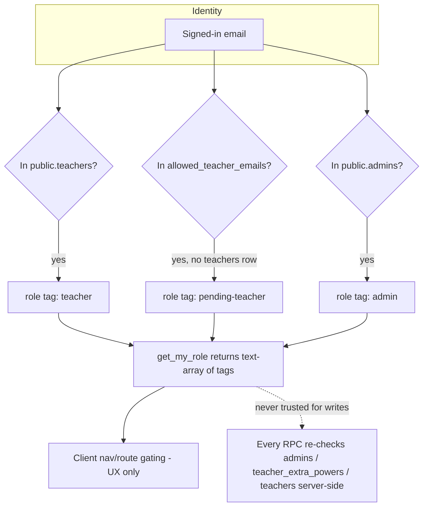

# Admin Console & Scheduling Upgrade — Design

## Overview

This feature adds an independent `admin` role to the MIS application and builds an Admin Console around it, then overhauls the Timetable module to match the college's real fixed-period schedule and wires Attendance to read confirmed periods from it. It ships in four independently shippable phases:

- **Phase 1** — Admin role foundation: `public.admins` table, `get_my_role()` extension, last-admin protection trigger, delegated Extra Powers, `RequireAdmin` guard + Admin Console shell.
- **Phase 2** — Admin bulk roster/session import: Session_Creation_Flow (batch + sections), admin-driven bulk CSV roster import reusing `parseRosterCsv`, roster remove-vs-delete, duplicate subject-section-assignment safeguard.
- **Phase 3** — Batch promotion & academic history: `promote_batch()` RPC, derived (not stored) stale-assignment handling, read-only Teaching History view.
- **Phase 4** — Timetable overhaul: fixed `periods` catalog, multi-period lab spanning, room/tutorial/special-activity metadata, per-(teacher, section) draft/confirmed lock, unified "My Schedule" view, cross-batch conflict detection, and Attendance's period selector sourced from confirmed timetable entries.

Every new capability follows the established `SECURITY DEFINER` RPC pattern from `add_allowed_teacher()` / `enforce_teacher_eligibility()` (migration 0027): the authorization check lives inside the function body, is re-verified on every call (never trusted from the client), and RLS remains the authoritative boundary. No existing teacher/student RLS policy is weakened — only new, additive checks are introduced. Admin and Teacher stay fully independent: holding one never implies the other, and every new RPC checks its OWN specific authorization fact (`is_admin()`, a specific Extra_Power, or both) rather than inferring authorization from a cached client-side role.

## Architecture

### Role model — the `get_my_role()` design decision

The existing `get_my_role()` (migration 0042) returns a single text value: `'teacher' | 'pending-teacher' | 'none'`. Requirement 1.8 requires it to additionally signal `'admin'`, and the Introduction states admin and teacher are **independent, coexistable** facts about one identity. A single mutually-exclusive string cannot represent "admin AND teacher" without inventing compound values for every future combination — and Requirements 1.9/1.10 phrase the nav-gating check as "when the resolved role **includes** admin" (`resolved role 'admin' include karta hai`), which is a set-membership phrasing, not an equality check.

**Decision: change `get_my_role()` to return `text[]` — a set of independent role tags — instead of a single string.**

```
'none'            → text[] '{}'            (empty array)
'teacher'         → text[] '{teacher}'
'pending-teacher' → text[] '{pending-teacher}'
'admin'           → text[] '{admin}'
admin + teacher   → text[] '{admin,teacher}'
admin + pending   → text[] '{admin,pending-teacher}'
```

Rejected alternatives and why:
- **Keep the string, add compound values** (`'admin-teacher'`, `'admin-pending-teacher'`, ...): works for two independent facts today but does not generalize — every future role/flag added to the routing signal would double the enum. It also makes "does this role include admin" an `IN (...)` list that must be kept in sync everywhere it's checked.
- **Keep `get_my_role()` untouched, add a separate `is_admin()` boolean RPC**: satisfies independence cleanly, but violates the literal text of Requirement 1.8, which requires the `Get_My_Role` RPC itself to return `'admin'`.

The array shape directly satisfies 1.8 (an `'admin'` tag is present when the caller's email is in `public.admins`, additive to the existing outcomes) and makes 1.9/1.10 a one-line `.includes('admin')` check. `get_my_role()` is internally still `SECURITY DEFINER`/`stable`, called the same way (`supabase.rpc('get_my_role')`), and remains a **UX routing convenience only** — every RPC that actually grants a capability re-derives authorization from `public.admins` / `public.teacher_extra_powers` / `public.teachers` itself, so a stale or spoofed client-side role array can never grant access; RLS and the RPC-body checks are the authoritative boundary, unchanged from the existing pattern.

This is a contained breaking change to `useUserRole()`'s return contract. It is safe because `get_my_role()` is an internal RPC introduced in the immediately-preceding bugfix, with exactly four call sites in the app (`RequireTeacher`, `RootRedirect`, `SignInRoute`, `OnboardingRoute`), all of which this design updates together. No external API compatibility is at risk.

```typescript
// src/presentation/auth/useUserRole.ts (revised)
export type RoleTag = 'admin' | 'teacher' | 'pending-teacher';

export interface UserRoleStatus {
  /** null while the first check for the current identity is in flight. */
  readonly roles: readonly RoleTag[] | null;
  readonly loading: boolean;
  /** Convenience derived flags — computed from `roles`, never fetched separately. */
  readonly isAdmin: boolean;
  readonly isTeacher: boolean;
  readonly isPendingTeacher: boolean;
}
```

`RequireTeacher` passes when `isTeacher || isPendingTeacher` (unchanged logical condition, just re-expressed against the array — an admin who is *also* an onboarded teacher still passes, an admin who is *not* a teacher at all still correctly fails this guard and is routed away from teacher-only surfaces, per Requirement 1.1). The new `RequireAdmin` passes when `isAdmin`. Nav gating (1.9/1.10) shows the Admin section when `isAdmin`.

### Phase rollout / capability model



### Admin Console navigation

A new `admin` nav group is added to `navGroups` (`src/presentation/navigation.ts`), visible only when `isAdmin`. Routes live under `/admin/*`, wrapped in a new `RequireAdmin` guard mirroring `RequireTeacher`'s shape, nested inside its own layout shell (reusing `AppLayout`, since the sidebar/topbar shell is role-agnostic chrome).

```typescript
// src/presentation/auth/RequireAdmin.tsx
import type { ReactNode } from 'react';
import { Navigate } from 'react-router-dom';
import { useUserRole } from '@presentation/auth/useUserRole';

interface RequireAdminProps {
  redirectTo?: string;
  fallback?: ReactNode;
  children: ReactNode;
}

/**
 * Render `children` only for a user whose `get_my_role()` roles include
 * 'admin'; otherwise redirect. Independent of RequireTeacher — an admin who
 * is not a teacher still passes this guard and fails RequireTeacher, and
 * vice versa (Requirement 1.1). Postgres RLS + each admin RPC's own
 * is_admin() check remain the authoritative boundary; this is UX gating only.
 */
export default function RequireAdmin({
  redirectTo = '/dashboard',
  fallback = null,
  children,
}: RequireAdminProps) {
  const { isAdmin, loading } = useUserRole();
  if (loading) return <>{fallback}</>;
  if (!isAdmin) return <Navigate to={redirectTo} replace />;
  return <>{children}</>;
}
```

`App.tsx` gains an `/admin` route subtree parallel to the teacher `TeacherShell`, not nested inside it — an admin who is not a teacher must reach `/admin/*` without ever passing through `RequireTeacher`/`OnboardingGate`:

```typescript
function AdminShell() {
  const navigate = useNavigate();
  const location = useLocation();
  const { signOut } = useAuth();
  return (
    <RequireAdmin>
      <AppLayout activePath={location.pathname} onNavigate={(p) => navigate(p)} onLogout={async () => { await signOut(); navigate('/sign-in', { replace: true }); }}>
        <Outlet />
      </AppLayout>
    </RequireAdmin>
  );
}

// inside <Routes>:
<Route element={<AdminShell />}>
  <Route path="/admin" element={<Navigate to="/admin/teachers" replace />} />
  <Route path="/admin/teachers" element={<AdminTeacherApprovalPage />} />
  <Route path="/admin/powers" element={<AdminExtraPowersPage />} />
  <Route path="/admin/admins" element={<AdminManageAdminsPage />} />
  <Route path="/admin/sessions" element={<AdminSessionCreationPage />} />
  <Route path="/admin/roster" element={<AdminRosterImportPage />} />
  <Route path="/admin/batches" element={<AdminBatchPromotionPage />} />
</Route>
```

`AppLayout`'s `SelectedSectionProvider` wraps the teacher shell only — the Admin Console does not depend on a globally-selected section (it manages sections themselves), so `AdminShell` does not include it, matching the "boundaries" guardrail in Requirement 4 (no editing teacher-scoped data in place).

## Components and Interfaces

### Phase 1 — Admin role foundation

#### Migration `0043_admin_role.sql`

```sql
-- ============================================================================
-- Migration: 0043_admin_role
-- Admin role foundation: public.admins table, last-admin protection,
-- get_my_role() extended to a role-tag array, is_admin() helper.
-- ============================================================================

-- ----------------------------------------------------------------------------
-- public.admins — email-keyed, mirrors allowed_teacher_emails shape exactly.
-- ----------------------------------------------------------------------------
create table if not exists public.admins (
    email      text primary key,
    added_by   uuid,
    created_at timestamptz not null default now()
);

alter table public.admins enable row level security;

-- Only a signed-in admin may read the admins table (mirrors
-- allowed_teacher_emails_read's is_teacher()-gated shape).
drop policy if exists admins_read on public.admins;
create policy admins_read on public.admins
  for select to authenticated using (public.is_admin());
-- No insert/update/delete policy: all writes go through add_admin()/remove_admin()
-- (SECURITY DEFINER), exactly like allowed_teacher_emails.

-- ----------------------------------------------------------------------------
-- is_admin() — SECURITY DEFINER so RLS/RPCs can consult admins regardless of
-- the caller's own RLS (mirrors is_teacher()'s membership-check shape).
-- ----------------------------------------------------------------------------
create or replace function public.is_admin()
returns boolean
language sql
stable
security definer
set search_path = public
as $$
  select exists (
    select 1 from public.admins a where lower(a.email) = lower(coalesce(auth.email(), ''))
  );
$$;

comment on function public.is_admin() is
  'Returns true when the caller''s email is present in public.admins. SECURITY DEFINER so RLS policies and other RPCs can consult it without recursion. Independent of is_teacher() — an identity may be admin, teacher, both, or neither (Requirement 1.1).';

-- ----------------------------------------------------------------------------
-- Last-admin protection — database-level, applies to ANY delete path
-- (direct SQL, remove_admin() RPC, future code), always active except the
-- documented one-time bootstrap (which INSERTs, never deletes).
-- ----------------------------------------------------------------------------
create or replace function public.protect_last_admin()
returns trigger
language plpgsql
security definer
set search_path = public
as $$
begin
    if (select count(*) from public.admins) <= 1 then
        raise exception
            'At least one admin must always remain. This is the last remaining admin and cannot be removed.';
    end if;
    return old;
end;
$$;

drop trigger if exists trg_protect_last_admin on public.admins;
create trigger trg_protect_last_admin
    before delete on public.admins
    for each row execute function public.protect_last_admin();

-- ----------------------------------------------------------------------------
-- add_admin(email) / remove_admin(email) — Admin-only, SECURITY DEFINER.
-- ----------------------------------------------------------------------------
create or replace function public.add_admin(p_email text)
returns jsonb
language plpgsql
security definer
set search_path = public
as $$
begin
    if not public.is_admin() then
        return jsonb_build_object('status', 'denied', 'reason', 'not-admin');
    end if;
    if p_email is null or btrim(p_email) = '' then
        return jsonb_build_object('status', 'denied', 'reason', 'invalid-email');
    end if;

    insert into public.admins (email, added_by)
    values (lower(btrim(p_email)), auth.uid())
    on conflict (email) do nothing;

    return jsonb_build_object('status', 'added', 'email', lower(btrim(p_email)));
end;
$$;

grant execute on function public.add_admin(text) to authenticated;

create or replace function public.remove_admin(p_email text)
returns jsonb
language plpgsql
security definer
set search_path = public
as $$
begin
    if not public.is_admin() then
        return jsonb_build_object('status', 'denied', 'reason', 'not-admin');
    end if;

    -- protect_last_admin() trigger raises an exception if this is the sole
    -- remaining row; catch it here so the RPC returns a structured denial
    -- instead of a raw Postgres error reaching the client.
    begin
        delete from public.admins where lower(email) = lower(btrim(p_email));
    exception when others then
        return jsonb_build_object('status', 'denied', 'reason', 'last-admin');
    end;

    if not found then
        return jsonb_build_object('status', 'not-found');
    end if;
    return jsonb_build_object('status', 'removed', 'email', lower(btrim(p_email)));
end;
$$;

grant execute on function public.remove_admin(text) to authenticated;

-- ----------------------------------------------------------------------------
-- get_my_role() — now returns text[] of independent role tags instead of a
-- single text value. BREAKING CHANGE to the return type, contained to the
-- four client call sites this spec updates together (RequireTeacher,
-- RootRedirect, SignInRoute, OnboardingRoute via useUserRole()).
-- ----------------------------------------------------------------------------
create or replace function public.get_my_role()
returns text[]
language plpgsql
stable
security definer
set search_path = public
as $$
declare
    v_uid   uuid := auth.uid();
    v_email text := lower(coalesce(auth.email(), ''));
    v_roles text[] := '{}';
begin
    if v_uid is null or v_email = '' then
        return v_roles;
    end if;

    if exists (select 1 from public.admins a where lower(a.email) = v_email) then
        v_roles := array_append(v_roles, 'admin');
    end if;

    if exists (select 1 from public.teachers t where t.id = v_uid) then
        v_roles := array_append(v_roles, 'teacher');
    elsif exists (select 1 from public.allowed_teacher_emails a where lower(a.email) = v_email) then
        v_roles := array_append(v_roles, 'pending-teacher');
    end if;

    return v_roles;
end;
$$;

comment on function public.get_my_role() is
  'Authoritative role check for client-side routing only. Returns a text[] of independent role tags present for the caller: any subset of {admin, teacher, pending-teacher} (teacher and pending-teacher remain mutually exclusive with each other; admin is fully independent of both). Empty array = no role (every student). Fails closed to {} on missing uid/email. Does not affect RLS; RLS + each RPC''s own is_admin()/is_teacher() check remain the authorization boundary.';

grant execute on function public.get_my_role() to authenticated;

notify pgrst, 'reload schema';
```

**Bootstrap (documented, not automated — Requirement 1.3):** the first admin row must be inserted once via the Supabase SQL editor:
```sql
insert into public.admins (email) values ('owner@example.com');
```
This is the only write path exempt from any UI control; it runs before any admin exists, so `is_admin()` would otherwise deny every RPC. Documented in `SETUP_GUIDE.md` alongside the existing `app.teacher_email` bootstrap note.

#### Migration `0044_teacher_extra_powers.sql`

```sql
-- ============================================================================
-- Migration: 0044_teacher_extra_powers
-- Delegated Extra Powers: cross_section_visibility, teacher_allowlist_approval.
-- ============================================================================

create table if not exists public.teacher_extra_powers (
    teacher_id  uuid not null references public.teachers (id) on delete cascade,
    power_name  text not null
        constraint teacher_extra_powers_power_name_allowed
        check (power_name in ('cross_section_visibility', 'teacher_allowlist_approval')),
    granted_by  uuid references public.admins (email) on delete set null,
    created_at  timestamptz not null default now(),
    primary key (teacher_id, power_name)
);

alter table public.teacher_extra_powers enable row level security;

-- A teacher may read their OWN granted powers (to conditionally show UI);
-- an admin may read every row (to manage grants).
drop policy if exists teacher_extra_powers_read_own on public.teacher_extra_powers;
create policy teacher_extra_powers_read_own on public.teacher_extra_powers
  for select to authenticated
  using (teacher_id = auth.uid() or public.is_admin());
-- No insert/update/delete policy: all writes go through
-- grant_teacher_extra_power()/revoke_teacher_extra_power() (SECURITY DEFINER).

-- has_extra_power(power) — helper for other RPCs/RLS to consult.
create or replace function public.has_extra_power(p_power text)
returns boolean
language sql
stable
security definer
set search_path = public
as $$
  select exists (
    select 1 from public.teacher_extra_powers
    where teacher_id = auth.uid() and power_name = p_power
  );
$$;

comment on function public.has_extra_power(text) is
  'True when the caller (by auth.uid()) has been granted the named Extra_Power. Scoped strictly to this one teacher — grants to other teachers never affect this result (Requirement 3.1/3.3).';

create or replace function public.grant_teacher_extra_power(p_teacher_email text, p_power text)
returns jsonb
language plpgsql
security definer
set search_path = public
as $$
declare
    v_teacher_id uuid;
begin
    if not public.is_admin() then
        return jsonb_build_object('status', 'denied', 'reason', 'not-admin');
    end if;
    if p_power not in ('cross_section_visibility', 'teacher_allowlist_approval') then
        return jsonb_build_object('status', 'denied', 'reason', 'invalid-power');
    end if;

    select id into v_teacher_id from public.teachers where lower(email) = lower(btrim(p_teacher_email));
    if v_teacher_id is null then
        return jsonb_build_object('status', 'denied', 'reason', 'teacher-not-found');
    end if;

    insert into public.teacher_extra_powers (teacher_id, power_name, granted_by)
    values (v_teacher_id, p_power, (select email from public.admins where lower(email) = lower(coalesce(auth.email(), ''))))
    on conflict (teacher_id, power_name) do update
        set granted_by = excluded.granted_by, created_at = now();

    return jsonb_build_object('status', 'granted', 'teacherId', v_teacher_id, 'power', p_power);
end;
$$;

grant execute on function public.grant_teacher_extra_power(text, text) to authenticated;

create or replace function public.revoke_teacher_extra_power(p_teacher_email text, p_power text)
returns jsonb
language plpgsql
security definer
set search_path = public
as $$
declare
    v_teacher_id uuid;
begin
    if not public.is_admin() then
        return jsonb_build_object('status', 'denied', 'reason', 'not-admin');
    end if;

    select id into v_teacher_id from public.teachers where lower(email) = lower(btrim(p_teacher_email));
    if v_teacher_id is null then
        return jsonb_build_object('status', 'denied', 'reason', 'teacher-not-found');
    end if;

    delete from public.teacher_extra_powers where teacher_id = v_teacher_id and power_name = p_power;

    return jsonb_build_object('status', 'revoked', 'teacherId', v_teacher_id, 'power', p_power);
end;
$$;

grant execute on function public.revoke_teacher_extra_power(text, text) to authenticated;

-- ----------------------------------------------------------------------------
-- remove_allowed_teacher(email) — gated on is_admin() OR
-- has_extra_power('teacher_allowlist_approval'). add_allowed_teacher() itself
-- is UNCHANGED (still is_teacher()-gated per the existing 0027 migration) —
-- Requirement 2.2 explicitly says the Admin_Console reuses the EXISTING RPC
-- for adds; this migration only adds the missing remove counterpart.
-- ----------------------------------------------------------------------------
create or replace function public.remove_allowed_teacher(p_email text)
returns jsonb
language plpgsql
security definer
set search_path = public
as $$
begin
    if not (public.is_admin() or public.has_extra_power('teacher_allowlist_approval')) then
        return jsonb_build_object('status', 'denied', 'reason', 'not-authorized');
    end if;

    delete from public.allowed_teacher_emails where lower(email) = lower(btrim(p_email));
    if not found then
        return jsonb_build_object('status', 'not-found');
    end if;
    return jsonb_build_object('status', 'removed', 'email', lower(btrim(p_email)));
end;
$$;

grant execute on function public.remove_allowed_teacher(text) to authenticated;

-- cross_section_visibility: extend sections/students/student_roster read
-- policies to also allow a teacher with this power, additive to the existing
-- is_teacher() shared-read policies (0014's shared-tables model is
-- unaffected — this only WIDENS who may read, never narrows).
drop policy if exists teacher_read_sections on public.sections;
create policy teacher_read_sections on public.sections
  for select to authenticated
  using (public.is_teacher() or public.has_extra_power('cross_section_visibility'));

notify pgrst, 'reload schema';
```

Note: `sections`/`students` already grant broad teacher read access under the shared model (migration 0014); `cross_section_visibility` here is additive insurance for any narrower per-teacher read policy introduced later, and is the explicit authorization fact `teacher_read_sections` now checks alongside `is_teacher()`. No audit log table is created — Requirement 3.7 explicitly says this access is silent, so nothing observes or records it.

### `useUserRole()` (revised)

```typescript
// src/presentation/auth/useUserRole.ts
import { useEffect, useState } from 'react';
import { supabase } from '@data/supabase';
import { useAuth } from './AuthContext';

export type RoleTag = 'admin' | 'teacher' | 'pending-teacher';
const VALID_TAGS: ReadonlySet<string> = new Set(['admin', 'teacher', 'pending-teacher']);

export interface UserRoleStatus {
  readonly roles: readonly RoleTag[] | null;
  readonly loading: boolean;
  readonly isAdmin: boolean;
  readonly isTeacher: boolean;
  readonly isPendingTeacher: boolean;
}

export function useUserRole(): UserRoleStatus {
  const { actor, isLoading: authLoading } = useAuth();
  const [roles, setRoles] = useState<readonly RoleTag[] | null>(null);
  const [loading, setLoading] = useState(true);
  const identityKey = actor.kind === 'anonymous' ? null : actor.userId;

  useEffect(() => {
    if (authLoading) return;
    if (identityKey === null) {
      setRoles([]);
      setLoading(false);
      return;
    }
    let active = true;
    setLoading(true);
    supabase.rpc('get_my_role').then(({ data, error }) => {
      if (!active) return;
      if (error || !Array.isArray(data) || !data.every((r) => VALID_TAGS.has(r))) {
        setRoles([]); // fail closed
      } else {
        setRoles(data as RoleTag[]);
      }
      setLoading(false);
    }).catch(() => { if (active) { setRoles([]); setLoading(false); } });
    return () => { active = false; };
    // eslint-disable-next-line react-hooks/exhaustive-deps
  }, [identityKey, authLoading]);

  const roleSet = roles ?? [];
  return {
    roles,
    loading: authLoading || loading,
    isAdmin: roleSet.includes('admin'),
    isTeacher: roleSet.includes('teacher'),
    isPendingTeacher: roleSet.includes('pending-teacher'),
  };
}
```

`RequireTeacher` changes its condition from `role !== 'teacher' && role !== 'pending-teacher'` to `!isTeacher && !isPendingTeacher`; `RootRedirect`/`SignInRoute`/`OnboardingRoute` follow the same substitution — every existing teacher/pending-teacher/anonymous routing outcome is preserved bit-for-bit (an admin-only identity, previously impossible, now correctly resolves `isTeacher = false` and is routed to `/sign-in` by these teacher-gated routes, exactly as any other non-teacher would be — it reaches the app only via `/admin/*`).

### Admin Console pages (Phase 1 UI)

- **`AdminTeacherApprovalPage`** — two lists: `Allowed_Teacher_Emails` rows (add via existing `add_allowed_teacher()`, remove via new `remove_allowed_teacher()`) and `public.teachers` rows annotated with onboarded status, read-only (Requirement 2.6). Add/remove controls are hidden when `!isAdmin && !hasPower('teacher_allowlist_approval')` (Requirement 2.4's client-side half); the RPC denial is the server-side half.
- **`AdminExtraPowersPage`** — per-teacher toggle for each of the two Extra_Power kinds, admin-only (`RequireAdmin` already covers this; no teacher, even with a power, may reach this page — only admins grant/revoke, Requirement 3.6).
- **`AdminManageAdminsPage`** — list `public.admins`, add via `add_admin()`, remove via `remove_admin()`, surfacing the `last-admin` denial reason as an inline explanatory message (Requirement 1.6).

## Data Models

### Phase 1

| Table | Columns | Notes |
|---|---|---|
| `public.admins` | `email text PK`, `added_by uuid`, `created_at timestamptz` | Mirrors `allowed_teacher_emails` shape exactly (Requirement 1.2). |
| `public.teacher_extra_powers` | `teacher_id uuid FK→teachers`, `power_name text CHECK IN (...)`, `granted_by text FK→admins.email`, `created_at timestamptz`, PK `(teacher_id, power_name)` | One row per granted power; absence of a row = default no-power (Requirement 3.3). |

### Phase 2 — Admin bulk roster/session import

#### Migration `0045_session_creation_and_duplicate_guard.sql`

```sql
-- ============================================================================
-- Migration: 0045_session_creation_and_duplicate_guard
-- Session_Creation_Flow RPC + database-level duplicate subject-section
-- assignment safeguard (Requirement 9.5).
-- ============================================================================

-- ----------------------------------------------------------------------------
-- create_session(batch_id, start_year, current_sem, section_count) — admin-
-- only, transaction-safe: creates the batch row, then exactly section_count
-- shared public.sections rows (no owner_id — Requirement 5.4). All-or-nothing:
-- any error anywhere in the function body rolls back the whole operation
-- (Postgres wraps a single function call in an implicit transaction).
-- ----------------------------------------------------------------------------
create or replace function public.create_session(
    p_batch_id      text,
    p_start_year    integer,
    p_current_sem   integer,
    p_section_count integer
)
returns jsonb
language plpgsql
security definer
set search_path = public
as $$
declare
    v_section_ids uuid[] := '{}';
    v_letter      text;
    v_new_id      uuid;
    i             integer;
begin
    if not public.is_admin() then
        return jsonb_build_object('status', 'denied', 'reason', 'not-admin');
    end if;
    if p_section_count < 0 then
        return jsonb_build_object('status', 'denied', 'reason', 'invalid-section-count');
    end if;
    if exists (select 1 from public.batches where id = p_batch_id) then
        return jsonb_build_object('status', 'denied', 'reason', 'duplicate-batch-code');
    end if;

    insert into public.batches (id, start_year, current_sem, status)
    values (p_batch_id, p_start_year, p_current_sem, 'classes');

    for i in 1..p_section_count loop
        v_letter := chr(64 + i); -- 1->'A', 2->'B', ...
        -- Name/batch MUST match the exact (name, batch) tuple
        -- getOrCreateRealSection() in onboarding.ts matches on — 'CSE-{sem}{letter}'
        -- — so a teacher who later claims this section via My_Teaching_Subjects
        -- resolves to THIS row instead of get-or-creating a duplicate
        -- (Requirement 7.1's "already-imported roster shows up immediately"
        -- depends on this naming convention being identical).
        insert into public.sections (name, batch, semester, department)
        values ('CSE-' || p_current_sem::text || v_letter, p_batch_id, p_current_sem::text, 'CSE')
        returning id into v_new_id;
        v_section_ids := array_append(v_section_ids, v_new_id);
    end loop;

    return jsonb_build_object('status', 'created', 'batchId', p_batch_id, 'sectionIds', v_section_ids);
end;
$$;

grant execute on function public.create_session(text, integer, integer, integer) to authenticated;

-- ----------------------------------------------------------------------------
-- Database-level duplicate-assignment safeguard (Requirement 9.5): the
-- EXISTING unique constraint is scoped to (teacher_id, subject_id, batch_id,
-- section, is_lab) — it only stops the SAME teacher double-claiming. We need
-- a second constraint scoped to ANY teacher claiming the same
-- (subject_id, batch_id, section), independent of is_lab (a theory claim and
-- a lab claim of the SAME subject+section+batch by two DIFFERENT teachers
-- must still be blocked, since is_lab is a flag on one teacher's claim, not a
-- separate "slot").
-- ----------------------------------------------------------------------------
create unique index if not exists teacher_assignments_subject_section_batch_unique
    on public.teacher_assignments (subject_id, batch_id, section);

notify pgrst, 'reload schema';
```

**Design note on the duplicate-assignment constraint:** a plain `unique (subject_id, batch_id, section)` index (no `is_lab` in the key) is intentionally stricter than the existing per-teacher constraint. Requirement 9.4 requires two *different subjects* on the same section/batch by two different teachers to both succeed — that case has a different `subject_id`, so it is unaffected by this index. Requirement 9.1 requires the *same* subject+section+batch to be blocked for a second teacher regardless of `is_lab` — this index enforces exactly that. `onboarding.ts`'s `saveOnboarding()` (delete-then-insert) and any admin-driven assignment path both insert through this same table, so the constraint applies uniformly to both (Requirement 9.2) with zero client-code duplication. On violation, Postgres raises a unique-violation error; the calling code (`saveOnboarding`, or a future admin path) catches it and surfaces a message that identifies only the combination, not the other teacher (Requirement 9.3):

```typescript
// src/features/onboarding/api/onboarding.ts — insert error handling (excerpt)
const { error: assignError } = await supabase.from('teacher_assignments').insert(rows);
if (assignError) {
  if (assignError.code === '23505' && assignError.message.includes('teacher_assignments_subject_section_batch_unique')) {
    throw new Error(messages.teacherAssignment.duplicateClaim); // "This subject/section is already assigned to another teacher."
  }
  throw new Error(assignError.message);
}
```

#### Bulk roster import — reusing `parseRosterCsv` from an admin entry point

Requirement 6.4 requires reusing the existing parser, not writing a new one. `parseRosterCsv` already accepts an optional third CSV column (`email`) and already validates the enrollment-number format via `isValidEnrollmentNumber` (Requirement 6.6 is already enforced by the existing parser — no parser change needed). The only gap is Requirement 6.1/6.2: the **admin** bulk-import path must additionally require `email` on every row (the existing teacher-driven `RosterView` path allows a null email — Requirement 6.7 says that existing behavior must not change). This is handled by a thin, additive validation wrapper in a new admin-only access module — not a parser change:

```typescript
// src/data/access/adminRosterImportAccess.ts
import type { ParsedRosterRow, RosterImportResult } from '../../domain/services/rosterImportService';
import { parseRosterCsv } from '../../domain/services/rosterImportService';
import { messages } from '../../domain/shared/messages';

/** Admin bulk-import result: the existing RosterImportResult, plus rows that
 *  parsed successfully but are missing the admin-required email. */
export interface AdminRosterImportResult extends RosterImportResult {
  readonly missingEmail: readonly ParsedRosterRow[];
}

/**
 * Wraps the existing, unmodified parseRosterCsv (Requirement 6.4: no new
 * parser) with the ADMIN-ONLY additional requirement that every row have an
 * email (Requirement 6.1/6.2). Rows the base parser already rejected
 * (format/duplicate/malformed) are passed through unchanged; only rows that
 * passed the base parser but lack an email are moved from `valid` into the
 * new `missingEmail` bucket, each annotated with the same rejection-message
 * shape the base parser uses elsewhere in the app.
 */
export function parseAdminRosterCsv(text: string): AdminRosterImportResult {
  const base = parseRosterCsv(text);
  const validWithEmail = base.valid.filter((row) => row.email !== null);
  const missingEmail = base.valid.filter((row) => row.email === null);
  return { valid: validWithEmail, rejected: base.rejected, missingEmail };
}
```

The Admin_Console's roster-import page surfaces `missingEmail` rows with `messages.rosterImport.missingEmail` (a new catalog entry), identifying each row's enrollment number — satisfying 6.2's "row and missing field" requirement without touching `parseRosterCsv` itself. Persistence reuses `createRosterImportAccess(client).replaceSection(sectionId, rows)` unchanged (Requirement 6.4) for the admin bulk path targeting a section created by `create_session`.

**Immediate binding (Requirement 6.3):** `replaceSection` already upserts every row's email straight into `student_roster` (the allowlist `request_quiz_access` binds against on first click — the existing "Case 1" path in migration 0027/0025). No new binding mechanism is introduced; admin-imported rows flow through the identical `student_roster` upsert as teacher-imported rows, so they are pre-bound the same way.

**Single-student add (Requirement 6.5):** a one-row equivalent of the same path —

```typescript
// src/data/access/adminRosterImportAccess.ts (continued)
export async function addSingleStudent(
  client: SupabaseClient,
  sectionId: string,
  row: { enrollmentNumber: string; name: string; email: string },
): Promise<void> {
  // Re-validate with the SAME pure checks the CSV path uses, so a manual add
  // can never bypass format/required-field rules the bulk path enforces.
  if (!isValidEnrollmentNumber(row.enrollmentNumber)) {
    throw new Error(messages.rosterImport.invalidEnrollment);
  }
  expectOk(await client.from('students').insert({ section_id: sectionId, enrollment_number: row.enrollmentNumber, name: row.name, email: row.email }));
  expectOk(await client.from('student_roster').upsert(
    { enrollment_number: row.enrollmentNumber, name: row.name, email: row.email },
    { onConflict: 'enrollment_number' },
  ));
}
```

This produces the same two rows (`students` + `student_roster`) a one-row CSV import through `replaceSection` would produce for that student, satisfying the equivalence in Requirement 6.5 — but as an additive `insert`/`upsert` rather than `replaceSection`'s destructive delete-then-insert, since a single add must never wipe the rest of the section's roster.

#### Roster remove vs. permanent delete (Requirement 8)

```sql
-- ============================================================================
-- Migration: 0046_roster_remove_and_delete.sql
-- Soft "remove from roster" vs. hard "permanently delete", both admin-only.
-- ============================================================================

-- remove_student_from_roster: nulls section_id (soft) — history (attendance,
-- marks, quiz_attempts) is FK'd to students.id, never to section_id directly
-- for those historical tables, so nulling section_id here does not cascade
-- or orphan any historical row (Requirement 8.1).
create or replace function public.remove_student_from_roster(p_student_id uuid)
returns jsonb
language plpgsql
security definer
set search_path = public
as $$
begin
    if not public.is_admin() then
        return jsonb_build_object('status', 'denied', 'reason', 'not-admin');
    end if;
    update public.students set section_id = null where id = p_student_id;
    if not found then
        return jsonb_build_object('status', 'not-found');
    end if;
    return jsonb_build_object('status', 'removed');
end;
$$;

grant execute on function public.remove_student_from_roster(uuid) to authenticated;

-- permanently_delete_student: hard delete. Requires p_confirmed = true as
-- defense-in-depth (Requirement 8.5) — the UI's two-step confirmation is a
-- convenience; the database still refuses the destructive path outright
-- without an explicit, non-defaultable flag.
create or replace function public.permanently_delete_student(p_student_id uuid, p_confirmed boolean)
returns jsonb
language plpgsql
security definer
set search_path = public
as $$
begin
    if not public.is_admin() then
        return jsonb_build_object('status', 'denied', 'reason', 'not-admin');
    end if;
    if p_confirmed is not true then
        return jsonb_build_object('status', 'denied', 'reason', 'not-confirmed');
    end if;

    delete from public.students where id = p_student_id;
    if not found then
        return jsonb_build_object('status', 'not-found');
    end if;
    return jsonb_build_object('status', 'deleted');
end;
$$;

grant execute on function public.permanently_delete_student(uuid, boolean) to authenticated;

notify pgrst, 'reload schema';
```

The Admin_Console's student-row UI offers "Remove from roster" as the primary/default action (Requirement 8.2) and "Permanently delete" as a visually distinct, secondary action requiring a confirmation dialog (Requirement 8.3) whose copy states the destructive/FK-breaking risk (Requirement 8.4) before calling `permanently_delete_student(id, true)`; dismissing the dialog never calls the RPC at all (Requirement 8.5's UI half), and even a compromised/buggy UI call with `p_confirmed = false` (or omitted) is rejected server-side (8.5's RPC half).

### Teacher pickup of admin-provisioned roster (Requirement 7)

No new code path: `fetchOnboardedSections()` (existing) already resolves a `(batch, section)` pair to a real `sections.id` via `getOrCreateRealSection`, matched by the exact `(name, batch)` tuple — `name = 'CSE-{sem}{Letter}'`. `create_session` creates sections with that same naming convention (see the SQL above), so a teacher who later picks that batch/section/subject in `My_Teaching_Subjects` resolves to the SAME section row `create_session` created — `getOrCreateRealSection`'s "get" branch matches it directly, so the roster `replaceSection`/`addSingleStudent` already imported is visible immediately via the existing `loadRoster` (students query filtered by `section_id`) with zero new code. `create_session` never inserts a `teacher_assignments` row, so the section remains unclaimed (shared model, Requirement 7.2) until a teacher's own `saveOnboarding`/Profile-page save creates one.

### Phase 2 (Data Models)

| Table | Columns | Notes |
|---|---|---|
| `public.batches` | *(unchanged)* | `create_session` inserts into the existing table; no schema change. |
| `public.sections` | *(unchanged)* | `create_session` inserts using the existing `(name, batch, semester, department)` columns from migration 0007; no owner column exists or is added (Requirement 5.4). |
| `public.teacher_assignments` | *(unchanged columns)* + new unique index `(subject_id, batch_id, section)` | The new index is the Requirement 9.5 database-level safeguard, additive to the existing per-teacher unique constraint from migration 0010. |
| `public.students` | *(unchanged)* | `remove_student_from_roster` nulls `section_id` (already nullable per migration 0001); `permanently_delete_student` hard-deletes the row. |

## Components and Interfaces (continued)

### Phase 3 — Batch promotion & academic history

#### `promote_batch()` RPC

```sql
-- ============================================================================
-- Migration: 0047_promote_batch.sql
-- Admin-only batch promotion, formalizing the manual pattern from migration
-- 0011_update_current_batches.sql into a callable RPC.
-- ============================================================================

create or replace function public.promote_batch(p_batch_id text)
returns jsonb
language plpgsql
security definer
set search_path = public
as $$
declare
    v_batch public.batches%rowtype;
begin
    if not public.is_admin() then
        return jsonb_build_object('status', 'denied', 'reason', 'not-admin');
    end if;

    select * into v_batch from public.batches where id = p_batch_id;
    if not found then
        return jsonb_build_object('status', 'denied', 'reason', 'batch-not-found');
    end if;

    if v_batch.current_sem >= 8 then
        update public.batches set status = 'graduated' where id = p_batch_id;
        return jsonb_build_object('status', 'graduated', 'batchId', p_batch_id);
    end if;

    update public.batches set current_sem = current_sem + 1 where id = p_batch_id;
    return jsonb_build_object('status', 'promoted', 'batchId', p_batch_id, 'newSem', v_batch.current_sem + 1);
end;
$$;

grant execute on function public.promote_batch(text) to authenticated;

notify pgrst, 'reload schema';
```

This touches only the one `batches` row identified by `p_batch_id` (a single `update ... where id = p_batch_id`, Requirement 10.3) and never writes to `sections`/`students`/`student_roster` at all (Requirement 10.4) — promotion is purely a `batches.current_sem`/`status` mutation, exactly mirroring what migration `0011_update_current_batches.sql` did manually.

#### Stale-assignment handling — derived, never stored

Requirement 11.6 forbids ever deleting historical data, and storing a `stale` boolean on `teacher_assignments` risks drifting out of sync with `batches.current_sem` (e.g. if a batch were ever demoted, or if the flag update were missed). Instead, staleness is a **pure derivation**, computed at query time from two already-authoritative facts: the assignment's subject's `sem` (via `syllabus_subjects.sem`) and the assignment's batch's CURRENT `current_sem` (via `batches.current_sem`, read live — never cached):

```typescript
// src/domain/services/teacherAssignmentService.ts (new)

export interface AssignmentWithContext {
  readonly assignmentId: string;
  readonly batchId: string;
  readonly subjectSem: number;
}
export interface BatchState {
  readonly batchId: string;
  readonly currentSem: number;
}

/**
 * A Teacher_Assignment is stale when its subject's semester is strictly
 * behind its batch's CURRENT semester — i.e. the batch has been promoted
 * past the semester this assignment was made for (Requirement 11.1).
 * Purely derived: no stored flag, so promotion never needs a second write to
 * "mark" assignments stale, and there is nothing that can drift out of sync
 * (Requirement 11.6 — historical data is never touched by this derivation).
 */
export function isStaleAssignment(
  assignment: AssignmentWithContext,
  batches: readonly BatchState[],
): boolean {
  const batch = batches.find((b) => b.batchId === assignment.batchId);
  if (!batch) return false;
  return assignment.subjectSem < batch.currentSem;
}

/** Filters out every stale assignment — the "active assignments" a
 *  dashboard/Attendance/Timetable surface should use (Requirement 11.2). */
export function activeAssignments<T extends AssignmentWithContext>(
  assignments: readonly T[],
  batches: readonly BatchState[],
): T[] {
  return assignments.filter((a) => !isStaleAssignment(a, batches));
}
```

`isStaleAssignment`/`activeAssignments` are pure and reused everywhere "active assignment" is computed — the Dashboard's section list, Attendance's/Timetable's section+subject scoping (via `SelectedSectionContext`'s `fetchOnboardedSections`, which is updated to call `activeAssignments` before deriving sections, so a stale assignment simply stops producing a selectable section — Requirement 11.2). Because it is a pure function over live-read `batches.current_sem`, promoting batch X can only change the derived staleness of assignments whose `batch_id = X` — assignments on any other batch read a different, untouched `batches` row and are therefore provably unaffected (Requirement 11.3).

**Teacher notification (Requirement 11.4):** a lightweight client-side banner, not a new notifications table — computed the same way:

```typescript
// src/features/onboarding/hooks/useStaleAssignmentNotice.ts (new)
// Loads the teacher's own assignments + all batches, derives which batches
// contain at least one now-stale assignment via isStaleAssignment, and
// returns that list of affected batch ids for the banner to render. No
// server-side notification record is created or dismissed — recomputed
// fresh every time the teacher loads the app, which is sufficient since the
// underlying condition (batch promoted, assignment not yet re-selected)
// persists until the teacher acts.
```

Shown once on `/dashboard` (and/or `/profile`) directing the teacher to `My_Teaching_Subjects` to re-select subjects for the new semester (Requirement 11.5 — no admin-driven auto-reassignment is introduced, matching the Introduction's explicit out-of-scope note).

#### Read-only Teaching History view (Requirement 12)

No new table or column. `Teaching_History_View` issues the SAME owner-scoped queries the live Attendance/Marks/Quiz pages already use (`attendance`/`mark_values`/`quiz_attempts` filtered by `owner_id = auth.uid()` via existing RLS from migration 0014/0015), but additionally filters to batches that are `status = 'graduated'` OR whose `current_sem` has advanced past the semester the historical record's subject belongs to — reusing the exact same `isStaleAssignment`-style comparison, just applied for display instead of exclusion. Results are grouped client-side by batch → semester → subject. Because RLS (`owner_id = auth.uid()`) is unchanged and untouched, one teacher's query can never return another teacher's rows (Requirement 12.4) — this is the SAME isolation guarantee migration 0014 already established, simply queried from a new read-only page with no insert/update/delete affordances rendered anywhere in it (Requirement 12.2).

### Phase 3 (Data Models)

No new tables or columns are introduced in Phase 3. `promote_batch()` mutates only existing `batches.current_sem`/`batches.status` columns (migration 0001/0010). Stale-assignment status and Teaching History are both pure derivations over existing tables (`teacher_assignments`, `syllabus_subjects.sem`, `batches.current_sem/status`, `attendance`, `mark_values`, `quiz_attempts`).

## Components and Interfaces (continued)

### Phase 4 — Timetable overhaul

#### `public.periods` catalog

```sql
-- ============================================================================
-- Migration: 0048_periods_catalog.sql
-- Fixed, college-wide Period catalog (Requirement 13).
-- ============================================================================

create table if not exists public.periods (
    id         text primary key,   -- 'P1'..'P7', 'LUNCH', 'SAT_BLOCK'
    label      text not null,      -- 'Period I', ..., 'Lunch Break', 'NCC/NSS/CLUB ACTIVITIES/SPORTS/NPTEL/T&P'
    start_time time not null,
    end_time   time not null,
    day_type   text not null default 'weekday'
        constraint periods_day_type_allowed check (day_type in ('weekday', 'saturday')),
    sort_order integer not null
);

alter table public.periods enable row level security;
drop policy if exists periods_read on public.periods;
create policy periods_read on public.periods for select to authenticated using (true);

-- Seed data matching the reference weekday schedule + the distinct Saturday
-- block (Requirement 13.1-13.3). Idempotent upsert.
insert into public.periods (id, label, start_time, end_time, day_type, sort_order) values
    ('P1',        'Period I',    '09:30', '10:20', 'weekday',  1),
    ('P2',        'Period II',   '10:20', '11:10', 'weekday',  2),
    ('P3',        'Period III',  '11:10', '12:00', 'weekday',  3),
    ('LUNCH',     'Lunch Break', '12:00', '12:40', 'weekday',  4),
    ('P4',        'Period IV',   '12:40', '13:30', 'weekday',  5),
    ('P5',        'Period V',    '13:30', '14:20', 'weekday',  6),
    ('P6',        'Period VI',   '14:20', '15:10', 'weekday',  7),
    ('P7',        'Period VII',  '15:10', '16:00', 'weekday',  8),
    ('SAT_BLOCK', 'NCC/NSS/CLUB ACTIVITIES/SPORTS/NPTEL/T&P', '09:30', '13:00', 'saturday', 1)
on conflict (id) do update set
    label = excluded.label, start_time = excluded.start_time, end_time = excluded.end_time,
    day_type = excluded.day_type, sort_order = excluded.sort_order;

notify pgrst, 'reload schema';
```

`sort_order` (not `start_time`) is the grid's authoritative ordering key — it is what "consecutive" means for Requirement 14's span-validity check (two periods are consecutive when their `sort_order` values differ by exactly 1 within the same `day_type`), which is more robust than comparing times across the lunch-break gap.

#### `timetable_entries` schema changes

```sql
-- ============================================================================
-- Migration: 0049_timetable_overhaul.sql
-- Period-based scheduling, multi-period lab spans, room/tutorial/special-
-- activity metadata, per-(teacher, section) confirm/lock status.
-- ============================================================================

-- Migration strategy for existing rows: the OLD free-text time_slot column is
-- KEPT (not dropped) so existing rows remain valid/readable; it simply stops
-- being written to by the editor for any NEW or EDITED entry (Requirement
-- 13.5). New columns are nullable so old rows do not need a backfill —a
-- teacher who has not touched the editor since this migration simply has
-- period_id = null entries that are excluded from the new period-based grid
-- and from the Requirement 18 conflict check (nothing to conflict on) until
-- they re-save through the new editor, at which point period_id is populated.
alter table public.timetable_entries add column if not exists period_id       text references public.periods (id);
alter table public.timetable_entries add column if not exists span_periods    integer not null default 1;
alter table public.timetable_entries add column if not exists room           text;
alter table public.timetable_entries add column if not exists is_tutorial    boolean not null default false;
alter table public.timetable_entries add column if not exists special_activity text
    constraint timetable_entries_special_activity_allowed
    check (special_activity is null or special_activity in ('library', 'mentor', 'club_activities', 'sports', 'ncc_nss'));

-- subject_id is currently NOT NULL (migration 0001). Relax it so a special-
-- activity entry can omit a subject (Requirement 15.4), then enforce the
-- precise invariant with a CHECK: exactly one of {subject_id, special_activity}
-- is non-null, UNLESS is_tutorial = true, in which case subject_id is
-- required regardless of special_activity (Requirement 15.4's tutorial
-- exemption carve-out).
alter table public.timetable_entries alter column subject_id drop not null;

alter table public.timetable_entries add constraint timetable_entries_subject_or_activity_check
    check (
        (is_tutorial and subject_id is not null)
        or (not is_tutorial and (
            (subject_id is not null and special_activity is null)
            or (subject_id is null and special_activity is not null)
        ))
    );

create index if not exists idx_timetable_entries_period on public.timetable_entries (period_id);

-- ----------------------------------------------------------------------------
-- section_timetable_status — per (teacher_id, section_id), NOT per section
-- alone (Requirement 16.1's exact wording: "Teacher-Section combination").
-- ----------------------------------------------------------------------------
create table if not exists public.section_timetable_status (
    teacher_id uuid not null references public.teachers (id) on delete cascade,
    section_id uuid not null references public.sections (id) on delete cascade,
    status     text not null default 'draft'
        constraint section_timetable_status_allowed check (status in ('draft', 'confirmed')),
    updated_at timestamptz not null default now(),
    primary key (teacher_id, section_id)
);

alter table public.section_timetable_status enable row level security;
drop policy if exists section_timetable_status_owner on public.section_timetable_status;
create policy section_timetable_status_owner on public.section_timetable_status
  for all to authenticated
  using (teacher_id = auth.uid()) with check (teacher_id = auth.uid());

notify pgrst, 'reload schema';
```

**Row default for "no status row yet" (Requirement 16.2):** rather than pre-inserting a row for every teacher-section pair, the application treats an ABSENT `section_timetable_status` row as `draft` (the SQL `default 'draft'` covers the case where a row exists but is unspecified; the accessor layer below covers the case where no row exists at all yet) — this is what "new Teacher-Section timetable defaults to draft" means in practice, without needing an insert trigger on every new assignment.

#### Confirm / Unlock RPCs (Requirement 16, integrating Requirement 18's conflict check)

```sql
-- ============================================================================
-- Migration: 0050_timetable_confirm_unlock.sql
-- ============================================================================

-- find_teacher_schedule_conflicts(teacher_id) — used by confirm_timetable()
-- and exposed standalone for the editor's live-save conflict check. Compares
-- EVERY pair of that teacher's entries (across ALL their sections/batches —
-- Requirement 18.4) on the same day whose [period_id, period_id+span_periods)
-- ranges (by sort_order) overlap (Requirement 18.2, multi-period-aware).
create or replace function public.find_teacher_schedule_conflicts(p_teacher_id uuid)
returns table (
    entry_a_id uuid, entry_b_id uuid, day_of_week text,
    b_batch_id text, b_section text, b_subject_id uuid, b_period_label text
)
language sql
stable
security definer
set search_path = public
as $$
    with teacher_entries as (
        select te.id, te.day_of_week, te.period_id, te.span_periods,
               s.batch, s.name as section_name, te.subject_id, se.name as section_id_name,
               p.sort_order as start_sort, p.day_type
        from public.timetable_entries te
        join public.sections s on s.id = te.section_id
        join public.sections se on se.id = te.section_id
        join public.teacher_assignments ta on ta.batch_id = s.batch and ta.section = right(s.name, 1)
        join public.periods p on p.id = te.period_id
        where ta.teacher_id = p_teacher_id and te.period_id is not null
    )
    select a.id, b.id, a.day_of_week, b.batch, b.section_name, b.subject_id, p2.label
    from teacher_entries a
    join teacher_entries b
      on a.id <> b.id
     and a.day_of_week = b.day_of_week
     and a.day_type = b.day_type
     -- overlap test on [start, start+span) ranges by sort_order
     and a.start_sort < b.start_sort + b.span_periods
     and b.start_sort < a.start_sort + a.span_periods
    join public.periods p2 on p2.id = (select period_id from public.timetable_entries where id = b.id);
$$;

grant execute on function public.find_teacher_schedule_conflicts(uuid) to authenticated;

-- confirm_timetable(section_id) — validates the CALLING teacher's entries for
-- that section (including the cross-batch conflict check) then transitions
-- status to 'confirmed' only if valid (Requirement 16.4).
create or replace function public.confirm_timetable(p_section_id uuid)
returns jsonb
language plpgsql
security definer
set search_path = public
as $$
declare
    v_conflict record;
begin
    if not public.is_teacher() then
        return jsonb_build_object('status', 'denied', 'reason', 'not-teacher');
    end if;

    select * into v_conflict from public.find_teacher_schedule_conflicts(auth.uid()) limit 1;
    if found then
        return jsonb_build_object(
            'status', 'denied', 'reason', 'conflict',
            'conflictingDay', v_conflict.day_of_week,
            'conflictingBatch', v_conflict.b_batch_id,
            'conflictingSection', v_conflict.b_section,
            'conflictingSubjectId', v_conflict.b_subject_id,
            'conflictingPeriod', v_conflict.b_period_label
        );
    end if;

    insert into public.section_timetable_status (teacher_id, section_id, status, updated_at)
    values (auth.uid(), p_section_id, 'confirmed', now())
    on conflict (teacher_id, section_id) do update set status = 'confirmed', updated_at = now();

    return jsonb_build_object('status', 'confirmed', 'sectionId', p_section_id);
end;
$$;

grant execute on function public.confirm_timetable(uuid) to authenticated;

-- unlock_timetable(section_id) — whole-section unlock, not per-entry
-- (Requirement 16.6). There is nothing per-entry to unlock: status lives on
-- section_timetable_status alone, so a single row update IS the whole-section
-- unlock; no entry-level "locked" flag exists to iterate.
create or replace function public.unlock_timetable(p_section_id uuid)
returns jsonb
language plpgsql
security definer
set search_path = public
as $$
begin
    if not public.is_teacher() then
        return jsonb_build_object('status', 'denied', 'reason', 'not-teacher');
    end if;

    update public.section_timetable_status
    set status = 'draft', updated_at = now()
    where teacher_id = auth.uid() and section_id = p_section_id;

    if not found then
        -- No row yet means it was already (implicitly) draft.
        return jsonb_build_object('status', 'already-draft', 'sectionId', p_section_id);
    end if;
    return jsonb_build_object('status', 'unlocked', 'sectionId', p_section_id);
end;
$$;

grant execute on function public.unlock_timetable(uuid) to authenticated;

-- Mutation guard: while confirmed, direct upsert/delete on timetable_entries
-- for that (teacher, section) is rejected at the RLS layer, not just the UI
-- (Requirement 16.5, enforced consistently regardless of call path).
drop policy if exists owner_all_timetable_entries on public.timetable_entries;
create policy owner_all_timetable_entries on public.timetable_entries
  for all to authenticated
  using (owner_id = auth.uid())
  with check (
    owner_id = auth.uid()
    and not exists (
      select 1 from public.section_timetable_status sts
      where sts.teacher_id = auth.uid() and sts.section_id = timetable_entries.section_id and sts.status = 'confirmed'
    )
  );

notify pgrst, 'reload schema';
```

**Multi-period lab span validation (Requirement 14):** enforced application-side in the editor before calling `upsertEntry` (period consecutiveness is a `sort_order`-difference check, not a constraint SQL can cheaply express across a variable span), and re-validated inside `confirm_timetable`'s conflict scan implicitly — a lab entry stores one `period_id` (its FIRST period) plus `span_periods`; every consumer (grid render, conflict check, My Schedule) expands `[period_id .. period_id + span_periods)` by `sort_order`, never by storing N separate rows:

```typescript
// src/domain/services/timetableService.ts (additions)

/** True when the given periods, ordered by sort_order, form one consecutive
 *  run with no gaps — the only shape a multi-period lab span may take
 *  (Requirement 14.1/14.3). */
export function isConsecutiveSpan(periods: readonly { sortOrder: number }[]): boolean {
  if (periods.length === 0) return false;
  const sorted = [...periods].sort((a, b) => a.sortOrder - b.sortOrder);
  return sorted.every((p, i) => i === 0 || p.sortOrder === sorted[i - 1].sortOrder + 1);
}

/** The full set of Period ids a (possibly multi-period) entry occupies, in
 *  order — used by the grid to render one merged cell (Requirement 14.2) and
 *  by the conflict/My-Schedule derivations to expand a span. */
export function spannedPeriodIds(
  entry: { readonly periodId: string; readonly spanPeriods: number },
  catalog: readonly { readonly id: string; readonly sortOrder: number; readonly dayType: string }[],
): string[] {
  const start = catalog.find((p) => p.id === entry.periodId);
  if (!start) return [];
  return catalog
    .filter((p) => p.dayType === start.dayType && p.sortOrder >= start.sortOrder && p.sortOrder < start.sortOrder + entry.spanPeriods)
    .sort((a, b) => a.sortOrder - b.sortOrder)
    .map((p) => p.id);
}
```

The explanatory rejection message (Requirement 14.3) is shown ONLY when `isConsecutiveSpan` returns false for the teacher's selected periods, immediately before the save call — an accepted (consecutive) selection never surfaces this message.

**Special-activity apply-on-save (Requirement 15.3):** the editor's in-progress `EditorState.specialActivity` field is local component state exactly like the existing `subjectId` field in `TimetableView`'s `EditorState` — nothing is written to `timetable_entries` until `handleSave` calls `upsertEntry`, mirroring the pattern already in place for every other editable field. No new "preview vs. commit" mechanism is needed; the existing form-then-submit shape already satisfies "selection alone never applies."

#### Unified "My Schedule" view (Requirement 17)

```typescript
// src/data/access/mySchedule.ts (new)
// Aggregates entries across ALL of a teacher's teacher_assignments — every
// batch/section/subject, not one section at a time (Requirement 17.1). Reads
// are still per-section under the hood (owner_id = auth.uid() RLS already
// scopes every read to the caller), just fanned out and merged client-side.

export interface MyScheduleCell {
  readonly entry: TimetableEntry & { readonly spanPeriods: number; readonly room: string | null };
  readonly sem: number;
  readonly section: string; // 'A' | 'B' | 'C'
  readonly subjectName: string;
}

/** Cell label formatter — pure, so the exact format is unit-testable in
 *  isolation (Requirement 17.2: `"SEM {n}({section}) {subject name}"`). */
export function formatScheduleCellLabel(sem: number, section: string, subjectName: string): string {
  return `SEM ${sem}(${section}) ${truncateSubjectName(subjectName)}`;
}

const MAX_SUBJECT_NAME_LENGTH = 24;

/** Deterministic truncation rule (Requirement 17.3): names at or under the
 *  threshold are returned unchanged; longer names are cut to the threshold
 *  minus an ellipsis, applied identically every time — never ad hoc. */
export function truncateSubjectName(name: string): string {
  return name.length <= MAX_SUBJECT_NAME_LENGTH ? name : `${name.slice(0, MAX_SUBJECT_NAME_LENGTH - 1)}…`;
}
```

Computed **client-side**: the teacher's `teacher_assignments` rows are already fetched (for the section selector); My Schedule additionally fetches `timetable_entries` for every distinct `section_id` among those assignments (a handful of queries, bounded by how many sections one teacher teaches — not a cost concern) and merges them in-browser. This is chosen over a server-side aggregation RPC because the formatting/truncation/labeling logic (Requirement 17.2/17.3) is presentation logic that belongs in the pure, unit-testable `timetableService`/`mySchedule` layer, consistent with how every other view in this codebase (Dashboard, Timetable, Attendance) keeps derivation pure and client-side with Supabase used only for storage. `SelectedSectionContext` and every single-section page (Attendance, Marks, Syllabus) are completely untouched — My Schedule is an entirely new, additive read path (Requirement 17.4).

#### Attendance integration (Requirement 19)

The precise branching Requirement 19.3 vs 19.5 needs is: **the fallback decision is based on the (teacher, section) `Timetable_Status`, never on whether entries happen to exist for the exact day/subject.**

```typescript
// src/data/access/timetableAccess.ts (addition)

export type ConfirmedPeriodsOutcome =
  | { readonly kind: 'not-confirmed' } // section_timetable_status is draft or absent -> caller falls back to DEFAULT_TIME_SLOTS
  | { readonly kind: 'confirmed'; readonly periods: readonly string[] }; // may be [] -> caller shows an EMPTY selector, no fallback

/**
 * Resolves what the Attendance period selector should show for one exact
 * (teacherId, sectionId, subjectId, dayOfWeek) combination.
 *
 * Two-step, status-first logic (this ordering is what distinguishes
 * Requirement 19.3 from 19.5 — the branch is decided BEFORE looking at
 * entries at all):
 *   1. Read section_timetable_status for (teacherId, sectionId). Absent or
 *      'draft' -> {kind: 'not-confirmed'}, regardless of whether any entries
 *      exist for this section at all (Req 19.3, applied consistently per
 *      Req 19.4 — every such section takes this same branch, never decided
 *      ad hoc).
 *   2. 'confirmed' -> query timetable_entries filtered to this EXACT
 *      section+subject+day, expand any multi-period spans, and return
 *      {kind: 'confirmed', periods} where `periods` may legitimately be an
 *      empty array when the confirmed timetable has nothing scheduled for
 *      this specific day/subject (Req 19.5 — an empty confirmed result is
 *      structurally distinct from "not confirmed" and must never fall
 *      through to DEFAULT_TIME_SLOTS).
 */
export async function resolveConfirmedPeriods(
  client: SupabaseClient,
  teacherId: string,
  sectionId: string,
  subjectId: string,
  dayOfWeek: DayOfWeek,
): Promise<ConfirmedPeriodsOutcome> {
  const { data: statusRow } = await client
    .from('section_timetable_status')
    .select('status')
    .eq('teacher_id', teacherId)
    .eq('section_id', sectionId)
    .maybeSingle();

  if (!statusRow || statusRow.status !== 'confirmed') {
    return { kind: 'not-confirmed' };
  }

  const { data: entryRows } = await client
    .from('timetable_entries')
    .select('period_id, span_periods')
    .eq('section_id', sectionId)
    .eq('subject_id', subjectId)
    .eq('day_of_week', dayOfWeek)
    .not('period_id', 'is', null);

  const periods = (entryRows ?? []).flatMap((row) =>
    spannedPeriodIds({ periodId: row.period_id, spanPeriods: row.span_periods }, periodsCatalogCache),
  );
  return { kind: 'confirmed', periods };
}
```

```typescript
// src/presentation/pages/AttendancePage.tsx (revised time-slot resolution)
const outcome = await resolveConfirmedPeriods(supabase, teacherId, selectedSection.id, selectedSubjectId, dayOfWeek);
const timeSlots = outcome.kind === 'not-confirmed' ? DEFAULT_TIME_SLOTS : outcome.periods;
```

`DEFAULT_TIME_SLOTS` itself is UNCHANGED and stays exactly as it is today — it remains the fallback value, never removed, so teachers who have not migrated to the new timetable system see identical behavior to today (Requirement 19.3's explicit backward-compatibility goal). This satisfies both halves that looked contradictory in the requirements: 19.3's fallback fires purely on `Timetable_Status !== 'confirmed'`, while 19.5's empty-selector case fires purely on `Timetable_Status === 'confirmed'` with zero matching entries — the two branches are mutually exclusive by construction because they are gated on the SAME single status read, not on two independent conditions that could both evaluate true.

### Phase 4 (Data Models)

| Table | Columns | Notes |
|---|---|---|
| `public.periods` | `id text PK`, `label text`, `start_time time`, `end_time time`, `day_type text CHECK`, `sort_order integer` | Fixed seed data; read-only to all authenticated users. |
| `public.timetable_entries` | *adds:* `period_id text FK→periods`, `span_periods integer default 1`, `room text`, `is_tutorial boolean default false`, `special_activity text CHECK`; *relaxes:* `subject_id` now nullable; *adds CHECK:* exactly one of `{subject_id, special_activity}` unless `is_tutorial` | Old `time_slot` column is kept, unused by the new editor going forward. |
| `public.section_timetable_status` | `teacher_id uuid FK→teachers`, `section_id uuid FK→sections`, `status text CHECK ('draft','confirmed')`, `updated_at timestamptz`, PK `(teacher_id, section_id)` | Absent row = implicit draft (Requirement 16.2). Keyed by the Teacher-Section pair per Requirement 16.1's exact wording, not by section alone. |

This concludes the per-phase data model reference (Phase 1-4 above). No table introduced in any phase removes or narrows an existing RLS policy — every new policy is additive, and every existing owner-scoped/shared-model boundary from migrations 0007-0042 remains in force unchanged.

## Correctness Properties

*A property is a characteristic or behavior that should hold true across all valid executions of a system — essentially, a formal statement about what the system should do. Properties serve as the bridge between human-readable specifications and machine-verifiable correctness guarantees.*

### Property 1: Role independence

For any identity and any combination of admin/teacher status, granting or revoking admin capability never changes that identity's teacher/pending-teacher status, and granting or revoking teacher/onboarding status never changes that identity's admin status — the two facts vary completely independently in `get_my_role()`'s returned tag set.

**Validates: Requirements 1.1**

### Property 2: Admin add/remove and last-admin protection

For any `public.admins` state with N ≥ 1 rows, an existing admin adding a new email results in that email's `get_my_role()` including `'admin'`; for any state with N ≥ 2 rows, an admin removing a row immediately excludes `'admin'` from that email's resolved roles; and for any state with exactly 1 row, ANY attempt to delete it — whether via `remove_admin()`, a direct table delete, or any other path — is rejected by the database with an explanatory error, leaving the row intact.

**Validates: Requirements 1.4, 1.5, 1.6, 1.7**

### Property 3: `get_my_role()` reflects admins-table membership additively

For any identity, `get_my_role()`'s returned tag set includes `'admin'` if and only if that identity's email is present in `public.admins`, independent of and additive to whatever teacher/pending-teacher tag the same call also returns.

**Validates: Requirements 1.8**

### Property 4: Admin navigation gating is exactly role-driven

For any resolved role-tag set, the Admin navigation section and every Admin-only route render if and only if the set includes `'admin'` — never for any set that excludes it, always for any set that includes it.

**Validates: Requirements 1.9, 1.10**

### Property 5: Allowlist add/remove authorization

For any caller and any allowlist add/remove request, the request succeeds if and only if the caller is an admin OR (for remove only) holds the `teacher_allowlist_approval` Extra_Power; for any caller lacking both, the server denies the request AND the corresponding UI control is hidden/disabled for that caller.

**Validates: Requirements 2.3, 2.4**

### Property 6: Extra Power scoping and default-off

For any two distinct teachers, granting an Extra_Power to one never causes `has_extra_power()` to return true for the other; and for any teacher with no grant row for a given power, that power resolves to false by default.

**Validates: Requirements 3.1, 3.3**

### Property 7: Extra Power grant metadata

For any Extra_Power grant action performed by an admin, the resulting `teacher_extra_powers` row's `granted_by` equals that admin's identity and `created_at` reflects the grant time.

**Validates: Requirements 3.4**

### Property 8: Extra Power grant/revoke round trip

For any teacher and any Extra_Power, granting then immediately revoking that power returns the teacher to the exact pre-grant state (`has_extra_power()` false), and the revoke takes effect immediately (no subsequent read observes the power as still active).

**Validates: Requirements 3.5**

### Property 9: Only admins grant/revoke Extra Powers

For any non-admin caller — including the teacher who is the subject of the grant — any attempt to grant or revoke an Extra_Power for any teacher (including themselves) is denied.

**Validates: Requirements 3.6**

### Property 10: `cross_section_visibility` grants silent access

For any teacher granted `cross_section_visibility`, reads of another teacher's sections/students succeed without an admin identity being required, and no `audit_log` row (or any other record) is created as a result of that read.

**Validates: Requirements 3.7**

### Property 11: Syllabus-subject candidate list matches the chosen semester exactly

For any semester number, the Session_Creation_Flow's candidate subject list equals exactly the set of `syllabus_subjects` rows whose `sem` equals that number — no more, no fewer.

**Validates: Requirements 5.2**

### Property 12: Session creation is atomic, shared, and count-exact

For any non-negative section count N and any new batch code, `create_session` creates exactly N shared `sections` rows (zero when N = 0, with the batch still committed), none of which carry any per-teacher ownership column populated; and if any step of the creation fails, no partial batch or section row is committed.

**Validates: Requirements 5.3, 5.4**

### Property 13: Duplicate batch code rejected, state unchanged

For any batch code that already exists in `public.batches`, a subsequent `create_session` call with that same code is rejected with a conflict-identifying result, and no new batch or section rows are created.

**Validates: Requirements 5.5**

### Property 14: Roster row required-field and format validation

For any uploaded roster row missing its enrollment number, name, or email, OR whose enrollment number does not match `^[0-9]{4}[A-Z]{2}[0-9]{6}$`, the admin bulk-import path rejects that row and identifies both the row and the specific violated field/format — for every other row (all three fields present, enrollment number matching the pattern), the row is accepted.

**Validates: Requirements 6.1, 6.2, 6.6**

### Property 15: Accepted roster email is immediately bound

For any roster row accepted with an email, the resulting `student_roster` entry is pre-bound such that a first quiz-link access for that email succeeds without any enrollment-verification step.

**Validates: Requirements 6.3**

### Property 16: Single-student add is equivalent to a one-row import

For any valid single-student input (enrollment number, name, email), the resulting `students`/`student_roster` rows are identical in content to what a one-row CSV import of the same data would produce via `replaceSection`.

**Validates: Requirements 6.5**

### Property 17: Admin-provisioned roster is immediately visible to the claiming teacher

For any section provisioned by `create_session` and populated via the admin roster-import path, when a teacher subsequently claims that batch/section/subject through My_Teaching_Subjects, the roster displayed to that teacher equals exactly the previously imported rows, with no manual entry required.

**Validates: Requirements 7.1**

### Property 18: New admin-created sections are never pre-assigned

For any section newly created by `create_session`, no `teacher_assignments` row references it until a teacher explicitly claims it via My_Teaching_Subjects.

**Validates: Requirements 7.2**

### Property 19: Remove-from-roster preserves history, permanent-delete requires explicit confirmation

For any student with existing historical attendance/marks/quiz-attempt records, `remove_student_from_roster` leaves every historical row unchanged while removing the student's future section visibility; and for any call to `permanently_delete_student` where `p_confirmed` is not exactly `true`, the delete does not execute and the student record remains intact.

**Validates: Requirements 8.1, 8.5**

### Property 20: Duplicate subject-section-batch assignment blocked across teachers and entry points

For any `(subject, section, batch)` combination already claimed by teacher T1 (via either My_Teaching_Subjects or an admin-driven path), an assignment attempt by any different teacher T2 for the same combination is rejected with a message that does not reveal T1's identity — while two different teachers claiming two different subjects for the same section/batch both succeed.

**Validates: Requirements 9.1, 9.2, 9.3, 9.4**

### Property 21: Batch promotion is correct across the full semester domain and isolated to the target batch

For any batch with `current_sem` in [1,7], promotion increments `current_sem` by exactly 1 and leaves `status` unchanged; for any batch with `current_sem = 8`, promotion sets `status` to `'graduated'` without further incrementing `current_sem`; and for any set of other existing batches (and the promoted batch's own `sections`/`students`/`student_roster` rows), none of their state changes as a result of promoting the target batch.

**Validates: Requirements 10.1, 10.2, 10.3, 10.4**

### Property 22: Only admins may promote a batch

For any non-admin caller, an attempt to invoke `promote_batch` is denied and no batch's `current_sem`/`status` changes.

**Validates: Requirements 10.5**

### Property 23: Stale-assignment derivation is correct and exclusion-consistent

For any batch promotion and any set of pre-existing `teacher_assignments` tied to that batch, an assignment is derived as stale if and only if its subject's `sem` is strictly less than the batch's current (post-promotion) `current_sem`; and the "active assignments" set consumed by dashboard/Attendance/Timetable derivations excludes exactly the assignments this predicate marks stale.

**Validates: Requirements 11.1, 11.2**

### Property 24: Promotion-triggered staleness is isolated per batch

For any assignment tied to a batch that was NOT the one just promoted, promoting a different batch never changes that assignment's derived staleness.

**Validates: Requirements 11.3**

### Property 25: Stale-assignment notification reflects the derived set exactly

For any teacher with one or more stale assignments at the time they access the app, the notification's set of identified affected batches equals exactly the set of batches containing at least one of that teacher's stale assignments — no omissions, no extras.

**Validates: Requirements 11.4**

### Property 26: Promotion and graduation never delete historical data

For any batch promotion or graduation event, the row counts and content of `attendance`, `mark_values`, and `quiz_attempts` tied to that batch's prior-semester subjects are identical before and after the event.

**Validates: Requirements 11.6**

### Property 27: Teaching History shows exactly the teacher's own past-semester/graduated records

For any teacher and any batch/semester that has since been promoted past or graduated, that teacher's Teaching_History_View results include exactly their own historical attendance/marks/quiz records for that semester, grouped by batch → semester → subject, and never include another teacher's records.

**Validates: Requirements 12.1, 12.4**

### Property 28: Period selection is restricted to the catalog

For any attempted timetable-entry value that is not a valid `periods.id`, creation/edit is rejected; for any value that IS a valid catalog id, it is accepted.

**Validates: Requirements 13.4**

### Property 29: Multi-period lab span validity

For any set of periods a teacher selects for a lab entry, the entry is accepted as a single multi-period entry if and only if those periods form one consecutive run (by `sort_order` within the same `day_type`) — and the "periods must be consecutive" explanatory message is shown if and only if the entry was rejected for this reason, never for an accepted entry.

**Validates: Requirements 14.1, 14.2, 14.3**

### Property 30: Entry metadata round trip

For any timetable entry saved with a room value and/or a tutorial marker, reading that entry back afterward returns the same room value and the same tutorial-marker state that was saved.

**Validates: Requirements 15.1, 15.2**

### Property 31: Special-activity selection applies only on save

For any in-progress special-activity selection in the entry editor, the underlying persisted entry remains unchanged until the editor's save/confirm action is invoked.

**Validates: Requirements 15.3**

### Property 32: Subject-vs-special-activity invariant

For any timetable entry, exactly one of `{subject_id, special_activity}` is non-null, UNLESS `is_tutorial` is true, in which case `subject_id` is non-null regardless of whether `special_activity` is also set.

**Validates: Requirements 15.4**

### Property 33: New Teacher-Section timetables default to draft

For any Teacher-Section pairing with no existing `section_timetable_status` row, the resolved status is `'draft'`.

**Validates: Requirements 16.2**

### Property 34: Confirm validates before transitioning; confirmed sections reject mutation until unlocked

For any set of a teacher's current timetable entries for a section, invoking "Confirm Timetable" transitions status to `'confirmed'` if and only if validation (including the Requirement 18 conflict check) passes — on failure, status remains `'draft'` and entries are unchanged; and for any section whose status is `'confirmed'`, any add/edit/delete attempt on its entries is rejected until an explicit "Unlock Timetable" action is performed.

**Validates: Requirements 16.4, 16.5**

### Property 35: Unlock is whole-section, never partial

For any confirmed section with N entries, "Unlock Timetable" transitions the status to `'draft'` and makes all N entries editable again in the same operation — never leaving a subset still locked.

**Validates: Requirements 16.6**

### Property 36: Draft status is never treated as confirmed for Attendance derivation

For any section whose `(teacher, section)` status is `'draft'` — whether newly created or freshly unlocked — the Attendance period-derivation logic never sources periods from its entries as a confirmed schedule.

**Validates: Requirements 16.7**

### Property 37: My Schedule aggregates every assignment with no cross-teacher leakage

For any teacher with `teacher_assignments` spanning multiple batches/sections, My_Schedule_View's aggregated entry set equals exactly the union of timetable entries derived from every one of that teacher's own assignments, and never includes an entry belonging to another teacher's assignment.

**Validates: Requirements 17.1**

### Property 38: Schedule cell label format

For any semester number, section letter, and subject name, the rendered cell label exactly matches the format `"SEM {n}({section}) {subject name}"`.

**Validates: Requirements 17.2**

### Property 39: Subject-name truncation is deterministic

For any subject name, applying the display truncation/wrap rule twice produces the same result as applying it once (idempotent), and the same input always produces the same output.

**Validates: Requirements 17.3**

### Property 40: Cross-batch conflict detection is comprehensive and informative

For any two timetable entries belonging to the same teacher (across any of their batches/sections/semesters) on the same day whose period spans overlap (accounting for multi-period labs), attempting to save or confirm the second is blocked, and the block identifies the conflicting entry's day, period, batch, section, and subject.

**Validates: Requirements 18.1, 18.2, 18.3, 18.4**

### Property 41: Confirmed-section Attendance selector matches confirmed entries exactly

For any Teacher-Section pair whose status is `'confirmed'`, and any exact `(section, subject, day)` combination, the Attendance period selector's contents equal exactly the periods scheduled by that combination's confirmed timetable entries — never the generic `DEFAULT_TIME_SLOTS` list.

**Validates: Requirements 19.1, 19.2**

### Property 42: Non-confirmed sections consistently fall back to the generic list

For any Teacher-Section pair whose status is not `'confirmed'` (draft, including never configured), the Attendance period selector equals `DEFAULT_TIME_SLOTS`, applied the same way for every such section.

**Validates: Requirements 19.3, 19.4**

### Property 43: Confirmed-but-empty selector never falls back

For any Teacher-Section pair whose status IS `'confirmed'` but which has zero scheduled periods for a specific `(section, subject, day)` combination, the Attendance selector is empty — it never falls back to `DEFAULT_TIME_SLOTS`.

**Validates: Requirements 19.5**

## Error Handling

Every new RPC returns a structured `jsonb` result with a `status` field (`'denied' | 'not-found' | 'added' | 'removed' | ...`) and, on denial, a machine-readable `reason` — following the exact convention `add_allowed_teacher()`/`request_quiz_access()` already established, rather than raising raw Postgres exceptions to the client. The one deliberate exception is `protect_last_admin()`, which raises a Postgres exception (since it is a `BEFORE DELETE` trigger, not a callable RPC with its own return value) — `remove_admin()` wraps the delete in a `begin/exception` block specifically to translate that exception into the same structured `{status: 'denied', reason: 'last-admin'}` shape callers of every other RPC already expect, so the client-side error-handling path is uniform.

Client-side, each new denial reason gets a specific message in `messages.ts` (following the existing `messages.rosterImport`/`messages.auth` pattern) rather than collapsing to `messages.error.generic` — consistent with the project's established convention (see `PROJECT_HANDOFF.md`'s "Update Protocol": thread a structured `reason` end-to-end through type → parser → UI copy whenever the server provides one). New catalog entries: `messages.admin.lastAdminProtected`, `messages.admin.notAuthorized`, `messages.rosterImport.missingEmail`, `messages.teacherAssignment.duplicateClaim`, `messages.timetable.periodsNotConsecutive`, `messages.timetable.conflict(day, period, batch, section, subject)`.

`messages.error.generic` remains reserved for genuinely unstructured failures (network errors, unexpected exceptions) exactly as today — every new denial path above returns a structured reason and therefore gets specific copy, not the generic fallback.

Database-level constraint violations (the new unique index on `teacher_assignments`, the `timetable_entries_subject_or_activity_check` CHECK) surface as Postgres error codes (`23505` unique-violation, `23514` check-violation) that calling code catches by `error.code`, matching the existing pattern already used elsewhere in the codebase for constraint-driven validation.

## Testing Strategy

### Dual testing approach

Unit tests cover specific examples, UI-only behaviors (list rendering, read-only page shape, confirmation-dialog copy, default-action wiring), and integration points between layers. Property-based tests cover the 43 universal properties above — each implemented as a single property test running a minimum of 100 iterations, tagged with a comment referencing its design property number, in the format:

```
// Feature: admin-console-and-scheduling-upgrade, Property 12: Session creation is atomic, shared, and count-exact
```

### Property-based testing library and scope

The project's existing pure-function modules (`rosterImportService.ts`, `timetableService.ts`, `rosterService.ts`) are already unit-tested with Vitest but have no PBT library installed yet. This spec introduces **fast-check** (the standard PBT library for TypeScript/Vitest projects) as a new dev dependency, pinned to an exact version.

PBT is applied to:
- Pure derivation/formatting functions (`isStaleAssignment`, `activeAssignments`, `isConsecutiveSpan`, `spannedPeriodIds`, `formatScheduleCellLabel`, `truncateSubjectName`, `resolveConfirmedPeriods`'s branching logic) — these are exactly the "pure function, clear input/output, wide input space" case PBT is built for.
- RPC authorization/invariant logic (`add_admin`/`remove_admin`/last-admin protection, Extra Power scoping, duplicate-assignment safeguard, batch promotion domain, roster validation) — tested via a Postgres test harness (or Supabase local dev stack) with generated inputs, using mocks/a seeded test database rather than 100 live round trips against production-shaped infrastructure, keeping cost low while still generating varied admin/teacher/batch/assignment combinations.

PBT is deliberately NOT applied to:
- Static schema/seed facts (Requirement 1.2's table shape, 13.1-13.3's fixed Period_Catalog content, 2.5's onboarded/pending distinction rendering) — these get one-time example/schema tests.
- Absence-of-a-control guardrails (Requirement 4.1-4.5, 12.2) — verified by a one-time UI/API-surface audit test, not repeated generation.
- Documentation/process-only requirements (1.3's bootstrap SQL, 6.4/6.7/9.5/11.5/12.3/13.5/17.4's implementation-reuse or non-regression constraints) — these are verified by code review and existing-behavior regression tests, not new generated-input properties.

### Unit tests (representative, non-exhaustive)

- `AdminTeacherApprovalPage` renders every `allowed_teacher_emails` row and distinguishes onboarded vs. pending teachers (Requirement 2.1, 2.5) — example test.
- `AdminTeacherApprovalPage` has no direct-edit control on any teacher row (Requirement 2.6) — example test.
- Admin Console never renders a raw-SQL input, a migration-runner control, an "edit as this user" action, or a bulk-delete control beyond roster remove/permanently-delete (Requirement 4.1-4.5) — one-time audit test across the Admin Console component tree.
- "Remove from roster" is the default/primary action on a student row; "Permanently delete" is visually distinct and behind a confirmation dialog with the destructive-risk warning copy (Requirement 8.2, 8.3, 8.4) — example tests.
- `Teaching_History_View` renders zero edit-capable controls (Requirement 12.2) — one-time audit test.
- Session_Creation_Flow prompts for batch code, sem type, sem number in that order (Requirement 5.1) — example test.

### Fix/regression checking for the `get_my_role()` contract change

Because `get_my_role()`'s return type changes from `text` to `text[]`, the four existing call sites (`RequireTeacher`, `RootRedirect`, `SignInRoute`, `OnboardingRoute`) are re-tested against the SAME teacher/pending-teacher/anonymous fixtures the prior bugfix spec (`student-signin-role-routing-fix`) already established, asserting identical routing outcomes post-change — a preservation check, not a new property, confirming the array-shape migration introduces no regression for any existing (non-admin) identity.

## Requirements Traceability

| Requirement | Addressed in |
|---|---|
| 1. Admin Role & Bootstrap | Architecture → Role model; Migration `0043_admin_role.sql`; Properties 1-4 |
| 2. Teacher Approval Management (UI) | Migration `0044_teacher_extra_powers.sql` (`remove_allowed_teacher`); `AdminTeacherApprovalPage`; Properties 5 |
| 3. Delegated Extra Powers | Migration `0044_teacher_extra_powers.sql`; `AdminExtraPowersPage`; Properties 6-10 |
| 4. Admin Console Boundaries | Architecture → Admin Console navigation (AdminShell excludes teacher-scoped editing); Testing Strategy → Unit tests (audit test) |
| 5. New Session Creation Flow | Migration `0045_session_creation_and_duplicate_guard.sql` (`create_session`); Properties 11-13 |
| 6. Bulk Roster Import Per Section | `adminRosterImportAccess.ts` (`parseAdminRosterCsv`, `addSingleStudent`); Properties 14-16 |
| 7. Teacher Pickup of Admin-Provisioned Roster | "Teacher pickup of admin-provisioned roster" section; Properties 17-18 |
| 8. Student Removal — Remove vs. Delete | Migration `0046_roster_remove_and_delete.sql`; Property 19 |
| 9. Duplicate Subject-Section Assignment Safeguard | Migration `0045...` unique index; onboarding.ts error handling; Property 20 |
| 10. Individual Batch Promotion | Migration `0047_promote_batch.sql`; Properties 21-22 |
| 11. Stale-Assignment Handling | `teacherAssignmentService.ts` (`isStaleAssignment`, `activeAssignments`); `useStaleAssignmentNotice`; Properties 23-26 |
| 12. Read-Only Teaching History View | "Read-only Teaching History view" section; Property 27 |
| 13. Fixed, College-Wide Period System | Migration `0048_periods_catalog.sql`; Property 28 |
| 14. Lab Entries Spanning Multiple Periods | Migration `0049_timetable_overhaul.sql`; `isConsecutiveSpan`/`spannedPeriodIds`; Property 29 |
| 15. Additional Entry Metadata | Migration `0049_timetable_overhaul.sql` (columns + CHECK); Properties 30-32 |
| 16. Confirm Timetable Lock Mechanism | Migration `0049...` (`section_timetable_status`); Migration `0050_timetable_confirm_unlock.sql`; Properties 33-36 |
| 17. Unified "My Schedule" View | "Unified My Schedule view" section (`mySchedule.ts`); Properties 37-39 |
| 18. Cross-Batch Conflict Detection | Migration `0050...` (`find_teacher_schedule_conflicts`, `confirm_timetable`); Property 40 |
| 19. Attendance Integration with Confirmed Timetable | "Attendance integration" section (`resolveConfirmedPeriods`); Properties 41-43 |
