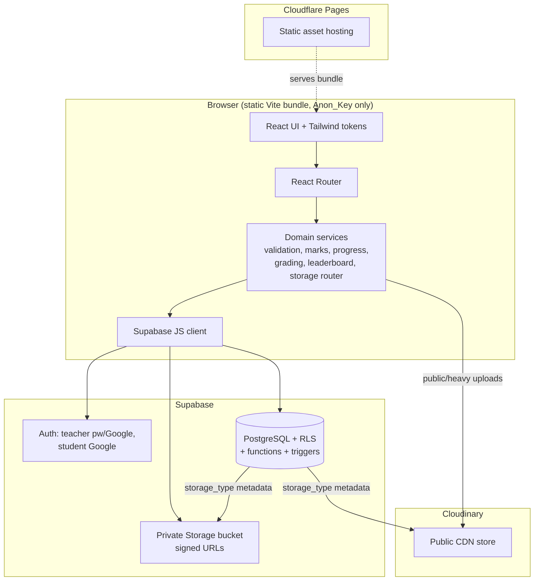
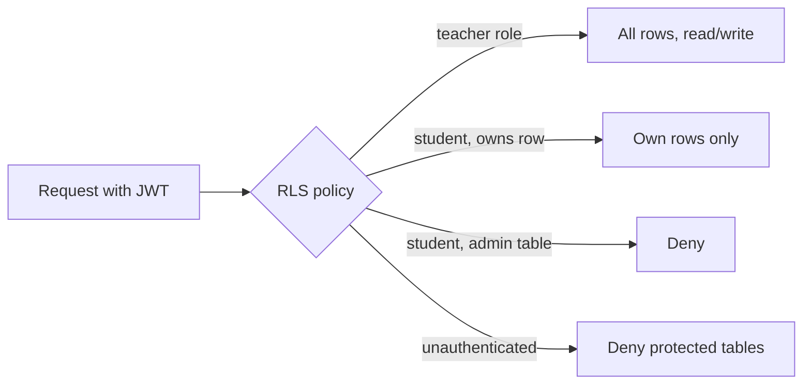
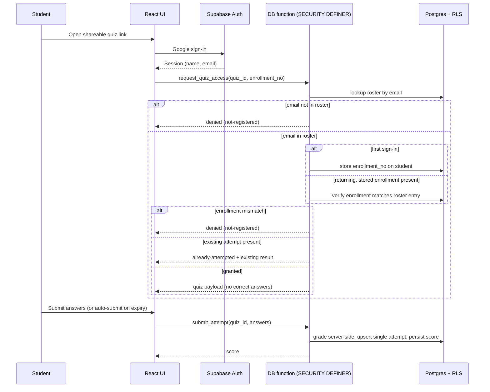
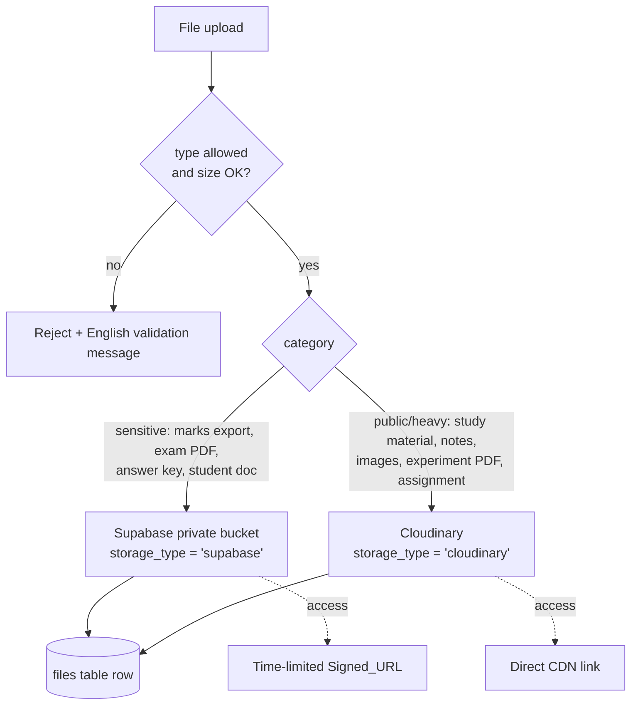
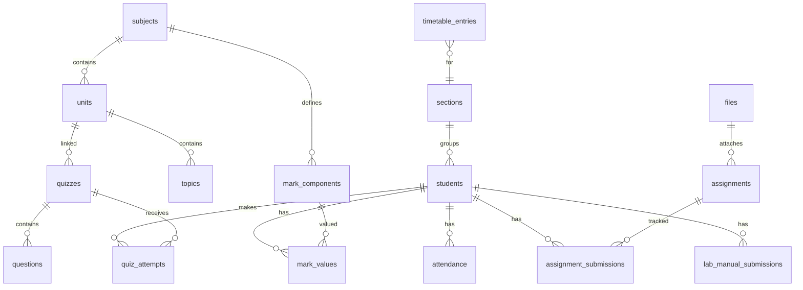

# Design Document

## Overview

Teacher Academic MIS is a single-teacher academic management application delivered as a static Vite/React bundle hosted on Cloudflare Pages, backed by Supabase (PostgreSQL, Auth, Storage) and Cloudinary (public/heavy file CDN). The system serves two distinct actor classes with very different trust levels:

- **Teacher** — one pre-provisioned administrator account with full read/write access to all data, operating the dashboard, attendance, syllabus, marks, quizzes, assignments, material, analytics, leaderboard, heatmap, and timetable modules.
- **Student** — an unregistered learner who reaches the system only through shareable quiz, assignment, or material links, authenticating with Google on demand and constrained to their own data.

The central design tension is that the frontend is fully public (a static bundle shipping only the Supabase `Anon_Key`), so **all authorization must be enforced server-side by PostgreSQL Row Level Security (RLS)**, never by the client. The client is treated as untrusted; it provides UX and convenience, while RLS policies, database constraints, and Postgres functions provide the actual security and correctness guarantees.

The design separates concerns into three layers:

1. **Presentation layer** (React components, Tailwind design tokens, routing) — renders views and captures input.
2. **Domain/service layer** (TypeScript pure functions and thin Supabase client wrappers) — validation, marks calculation, progress/attendance math, leaderboard scoring, quiz grading, storage routing. This layer holds the testable business logic.
3. **Data layer** (Supabase Postgres with RLS, database functions/triggers, Storage buckets, Cloudinary) — persistence, access control, audit logging, signed URLs.

This separation lets the bulk of correctness-critical logic (calculations, validation, grading, routing decisions) live in pure functions that are unit- and property-testable in isolation, while integration concerns (RLS enforcement, signed URLs, Google OAuth) are verified with targeted integration tests.

Two advanced capabilities (AI Quiz Generator and Risk Predictor) are present only as feature-flagged, locked placeholders; no AI logic is implemented in this version.

### Scope of this Design

| In scope | Out of scope (this version) |
|---|---|
| Teacher auth (email/password + Google) | Teacher self-signup |
| Student Google auth gated by roster | Student signup/passwords |
| Period attendance, syllabus, marks, quizzes | AI Quiz Generator logic |
| Assignment distribution + physical trackers | Risk Predictor logic |
| Material sharing, leaderboard, analytics, heatmap, timetable | Online student file submission |
| RLS, audit logging, hybrid storage, seed data, deployment config | Multi-teacher / multi-tenant |

## Architecture

### High-Level Architecture



### Authorization Model

Authorization is layered and defense-in-depth, but the **authoritative boundary is RLS in Postgres**:



- The Teacher is identified by a fixed role claim (a `is_teacher()` SQL helper that checks the authenticated user's id/email against the single provisioned teacher identity).
- Students are ordinary authenticated Supabase users whose `auth.uid()` maps to a `students` row; RLS restricts them to rows where `student_id = auth.uid()`-linked ownership.
- Administrative tables (marks, attendance, syllabus, audit log, roster management, timetable, mark components) deny all student access entirely.
- The `Service_Role_Key` is never shipped; privileged operations that genuinely need elevation are implemented as `SECURITY DEFINER` Postgres functions with their own internal checks rather than client-side service-role usage.

### Request/Authorization Flow — Quiz Attempt (representative)



Grading and correct-answer comparison happen server-side in a Postgres function so the client never receives the answer key, and the single-attempt rule is enforced by a database uniqueness constraint plus an upsert in the function.

### Storage Routing Flow



### Technology Decisions

| Concern | Decision | Rationale |
|---|---|---|
| Frontend framework | React + Vite + TypeScript | Required; fast static build for Cloudflare Pages |
| Styling | Tailwind CSS with design tokens | Required; tokens map to Req 20 palette/radii |
| Backend | Supabase (Postgres, Auth, Storage) | Required; RLS gives server-side authz without custom backend |
| Public/heavy files | Cloudinary | Required; CDN performance for unauthenticated material |
| Authorization | Postgres RLS + `SECURITY DEFINER` functions | Static client cannot be trusted; DB is the single enforcement point |
| Charts | A React charting library (e.g. Recharts) | Declarative charts for dashboard/analytics/heatmap |
| Validation | Schema validation (e.g. Zod) + sanitization helper | Centralized, testable input validation (Req 17) |
| Property testing | fast-check (TS) | Mature PBT library for the domain layer |

## Components and Interfaces

The application is organized into the modules named in the requirements glossary. Each UI module is backed by a domain service module of pure/near-pure functions plus a data-access wrapper.

### Auth & Session (`authService`)

Handles teacher email/password and Google login, student Google login, sign-out, and session restoration. Exposes the current actor role to the UI for navigation gating only (never for authorization).

```typescript
type Actor =
  | { kind: 'teacher'; userId: string; email: string }
  | { kind: 'student'; userId: string; email: string; name: string; enrollmentNumber: string | null }
  | { kind: 'anonymous' };

interface AuthService {
  signInTeacherPassword(email: string, password: string): Promise<Result<Actor, AuthError>>;
  signInWithGoogle(intent: 'teacher' | 'student'): Promise<Result<Actor, AuthError>>;
  signOut(): Promise<void>;
  getCurrentActor(): Promise<Actor>;
}
```

### Student Roster & Access (`rosterService`)

Maintains the roster and resolves quiz access. Enrollment validation is a pure function; access resolution is a DB function call.

```typescript
// Pure, testable
function isValidEnrollmentNumber(value: string): boolean; // 4 digits, 2 uppercase letters, 6 digits

interface RosterEntry { enrollmentNumber: string; email: string; name?: string; }

type QuizAccess =
  | { status: 'granted'; quiz: QuizPayloadNoAnswers }
  | { status: 'denied'; reason: 'not-registered' }
  | { status: 'already-attempted'; result: AttemptResult };

interface RosterService {
  upsertEntry(entry: RosterEntry): Promise<Result<RosterEntry, ValidationError>>;
  resolveQuizAccess(quizId: string, email: string, providedEnrollment: string | null): Promise<QuizAccess>;
}
```

### Attendance (`attendanceService`)

Period-level marking with live counts and upsert semantics keyed by `(section, subject, date, time_slot, student)`.

```typescript
interface PeriodKey { sectionId: string; subjectId: string; date: string; timeSlot: string; }
interface AttendanceMark { studentId: string; present: boolean; }

// Pure
function liveCounts(marks: AttendanceMark[]): { present: number; absent: number };

interface AttendanceService {
  loadPeriod(key: PeriodKey): Promise<AttendanceMark[]>;          // returns saved values if present
  savePeriod(key: PeriodKey, marks: AttendanceMark[]): Promise<void>; // upsert, one row per student, audited
}
```

### Syllabus (`syllabusService`)

Units/topics CRUD, planning, completion toggles, progress and schedule status.

```typescript
interface Topic { id: string; name: string; complete: boolean; }
interface Unit { id: string; name: string; topics: Topic[]; plannedDate?: string; }

// Pure
function progressPercent(unitOrSubjectTopics: Topic[]): number; // completed/total*100, 0 when empty
function scheduleStatus(actualPercent: number, plannedPercentForToday: number): 'on-schedule' | 'behind-schedule';
```

### Marks (`marksService`)

Teacher-defined weighted components and per-student internal marks.

```typescript
interface MarkComponent { id: string; name: string; maxValue: number; weightage: number; }
interface MarkValue { componentId: string; value: number; }

// Pure
function validateMarkValue(value: number, component: MarkComponent): Result<number, ValidationError>; // 0..maxValue
function computeInternalMarks(components: MarkComponent[], values: MarkValue[]): number; // weighted total
```

### Quiz (`quizService`)

MCQ creation, shareable link, time limit, server-side grading, single attempt.

```typescript
interface Question { id: string; text: string; options: string[]; correctIndex: number; marks: number; } // marks default 1
interface Quiz { id: string; unitId: string; timeLimitMinutes: number; questions: Question[]; shareToken: string; } // timeLimit default 15

// Pure (used by server-side grading function and tests)
function gradeAttempt(questions: Question[], answers: Record<string, number>): number; // no negative marking
```

### Assignment (`assignmentService`)

Assignment publication (file shared, no student upload) plus independent Assignment and Lab Manual trackers.

```typescript
interface Assignment { id: string; title: string; subjectId: string; unitId: string; dueDate: string; fileId: string; shareToken: string; }
type SubmissionStatus = 'submitted' | 'not-submitted';

interface AssignmentService {
  setAssignmentSubmission(assignmentId: string, studentId: string, unitId: string, status: SubmissionStatus): Promise<void>;
  setLabManualSubmission(studentId: string, unitId: string, status: SubmissionStatus): Promise<void>; // independent grid
}
```

### Material (`materialService`)

Upload to Cloudinary, public link, list.

### Leaderboard (`leaderboardService`)

```typescript
interface LeaderboardWeights { internalMarks: number; quizScores: number; attendance: number; }
interface StudentMetrics { studentId: string; name: string; internalMarks: number; quizScore: number; attendancePercent: number; }

// Pure
function combinedScore(m: StudentMetrics, w: LeaderboardWeights): number;
function rankStudents(metrics: StudentMetrics[], w: LeaderboardWeights): StudentMetrics[]; // desc score, tie-break name asc
```

### Analytics (`analyticsService`)

```typescript
// Pure
function classAverage(values: number[]): number;
function lowestScoringUnit(unitAverages: { unitId: string; average: number }[]): string | null;
function gradeDistribution(scores: number[]): Record<string, number>;
function isAtRisk(performancePercent: number, threshold: number): boolean; // threshold default 60
```

### Heatmap (`heatmapService`)

```typescript
// Pure
function attendancePercent(attendedPeriods: number, totalHeldPeriods: number): number;
function defaulters(students: { studentId: string; attendedPeriods: number; totalHeldPeriods: number }[]): string[]; // < 75%
function dayHeatLevel(periodsForDay: AttendanceMark[]): number; // aggregated attendance level for a day cell
```

### Timetable (`timetableService`)

Weekly grid CRUD; the Dashboard's "today's classes" is derived from timetable data.

### Storage Router (`storageRouter`)

```typescript
type StorageType = 'supabase' | 'cloudinary';
type FileCategory =
  | 'marks-export' | 'exam-pdf' | 'answer-key' | 'student-document'   // sensitive
  | 'study-material' | 'notes' | 'image' | 'experiment-pdf' | 'assignment'; // public/heavy

// Pure
function routeStorage(category: FileCategory): StorageType;
function validateUpload(fileType: string, sizeBytes: number, policy: UploadPolicy): Result<void, ValidationError>;
```

### Validation & Sanitization (`inputGuard`)

```typescript
// Pure
function sanitizeText(input: string): string;       // neutralize script/markup
function validateStructured<T>(input: unknown, schema: Schema<T>): Result<T, ValidationError>;
```

### Feature Flags (`featureFlags`)

Reads `FEATURE_AI` from build-time env; controls locked rendering of AI Quiz Generator and Risk Predictor without code-structure changes.

## Data Models

All tables have RLS enabled. "Admin-only" tables deny all student access; "student-owned" tables expose only the requesting student's rows.



### Tables

**students** (admin-managed; student can read own row)
- `id` (uuid, PK, links to `auth.uid()` once student signs in), `name`, `email` (unique), `enrollment_number` (nullable until first sign-in, validated by pattern), `section_id` (FK), `created_at`

**student_roster** (admin-only) — authoritative allowlist
- `id`, `enrollment_number` (CHECK matches `^[0-9]{4}[A-Z]{2}[0-9]{6}$`), `email` (unique), `name`, `created_at`

**sections** (admin-only): `id`, `name`

**subjects** (admin-only): `id`, `name`, `semester`

**units** (admin-only): `id`, `subject_id` (FK), `name`, `planned_date` (nullable)

**topics** (admin-only): `id`, `unit_id` (FK), `name`, `complete` (bool), `planned_date` (nullable)

**timetable_entries** (admin-only): `id`, `section_id`, `subject_id`, `day_of_week`, `time_slot`

**attendance** (admin-only): `id`, `student_id`, `section_id`, `subject_id`, `date`, `time_slot`, `present` (bool), `updated_by`, `updated_at`
- UNIQUE `(student_id, section_id, subject_id, date, time_slot)` — enforces upsert / no duplicate (Req 5.6)

**mark_components** (admin-only): `id`, `subject_id`, `name`, `max_value`, `weightage`

**mark_values** (admin-only): `id`, `student_id`, `component_id`, `value` (CHECK `0 <= value <= max_value` enforced in function/trigger), `internal_marks_snapshot`, `updated_by`, `updated_at`

**quizzes** (admin-only write; access via function): `id`, `unit_id`, `title`, `time_limit_minutes` (default 15), `share_token` (unique), `created_at`

**questions** (admin-only; correct answer never exposed to students): `id`, `quiz_id`, `text`, `options` (jsonb array), `correct_index`, `marks` (default 1)

**quiz_attempts** (student owns own; teacher reads all): `id`, `quiz_id`, `student_id`, `answers` (jsonb), `score`, `submitted_at`
- UNIQUE `(quiz_id, student_id)` — enforces exactly one attempt (Req 8.11)

**assignments** (admin-only write; public read via share token): `id`, `title`, `subject_id`, `unit_id`, `due_date`, `file_id` (FK), `share_token` (unique)

**assignment_submissions** (admin-only): `id`, `assignment_id`, `student_id`, `unit_id`, `status`
- UNIQUE `(assignment_id, student_id, unit_id)`

**lab_manual_submissions** (admin-only, independent): `id`, `student_id`, `unit_id`, `status`
- UNIQUE `(student_id, unit_id)`

**files** (admin-only metadata): `id`, `category`, `storage_type` (CHECK in `('supabase','cloudinary')`), `url_or_path`, `mime_type`, `size_bytes`, `created_at`

**leaderboard_config** (admin-only): `id`, `enabled` (bool), `weight_internal`, `weight_quiz`, `weight_attendance`

**settings** (admin-only): `id`, `performance_threshold` (default 60), `feature_ai` (bool)

**audit_log** (admin read-only; students fully denied — Req 19.4): `id`, `actor_id`, `record_ref`, `change_type` (`create|update|delete`), `table_name`, `timestamp`

### RLS Policy Summary

| Table group | Teacher | Student | Anonymous |
|---|---|---|---|
| Admin-only (most tables, audit_log) | full | deny | deny |
| `students` | full | read own row | deny |
| `quiz_attempts` | read all | read/insert own | deny |
| Public-by-token (`assignments`, `quizzes` via function, material) | full | scoped via function | read via share token/CDN |

### Audit Trigger

A trigger on `attendance`, `mark_values`, and `mark_components` writes an `audit_log` row capturing actor (`auth.uid()`), record reference, change type, and timestamp on every insert/update/delete (Req 5.7, 7.7, 19.2, 19.3).

## Correctness Properties

*A property is a characteristic or behavior that should hold true across all valid executions of a system — essentially, a formal statement about what the system should do. Properties serve as the bridge between human-readable specifications and machine-verifiable correctness guarantees.*

These properties target the **domain/service layer** of pure functions. Server-side enforcement concerns (RLS, signed URLs, Google OAuth, audit triggers) are verified by integration tests described in the Testing Strategy, not by property-based tests. After reflection, redundant criteria were consolidated so each property below provides unique validation value.

### Property 1: Enrollment number validation matches the pattern

*For any* string, `isValidEnrollmentNumber` returns true if and only if the string matches the pattern of exactly four digits, then two uppercase letters, then six digits (e.g. `0131CS241000`); roster upsert accepts conforming values and rejects non-conforming values.

**Validates: Requirements 2.2, 21.3**

### Property 2: Roster-gated access decision

*For any* roster and any `(email, providedEnrollment)` pair, quiz access resolves to `granted` if and only if the email matches a roster entry **and** the provided enrollment number equals that entry's stored enrollment number; otherwise it resolves to `denied` (not-registered).

**Validates: Requirements 2.5, 2.6, 8.5, 8.6**

### Property 3: Live attendance counts partition the roster

*For any* list of attendance marks, the live present count equals the number of marks flagged present, the absent count equals the number flagged absent, and present count plus absent count equals the total number of marks.

**Validates: Requirements 5.3**

### Property 4: Attendance save/load round-trip

*For any* period key and set of attendance marks, saving the period and then loading it returns marks equivalent to those saved (one record per student).

**Validates: Requirements 5.4, 5.5**

### Property 5: Attendance save is idempotent

*For any* period key and set of attendance marks, saving once and saving twice produce identical stored state with the same number of stored records (no duplicate records per student/period).

**Validates: Requirements 5.6**

### Property 6: Syllabus progress equals completed over total

*For any* set of topics, the progress percentage equals (completed topics / total topics) × 100 and lies within [0, 100]; when the set is empty the progress is 0.

**Validates: Requirements 6.5, 6.7**

### Property 7: Schedule status reflects planned comparison

*For any* actual progress percent and planned progress percent, the schedule status is `behind-schedule` if and only if actual is strictly less than planned, otherwise `on-schedule`.

**Validates: Requirements 6.6**

### Property 8: Mark value validation respects bounds

*For any* mark value and mark component, the value is accepted if and only if it is greater than or equal to zero and less than or equal to the component's configured maximum; otherwise it is rejected.

**Validates: Requirements 7.5**

### Property 9: Internal marks are the weighted total of components

*For any* set of mark components and their per-student values, the computed internal marks equal the deterministic weighted total of the component values, bounded by zero and the sum of the configured weightages, and the total is non-decreasing as any individual value increases.

**Validates: Requirements 7.4**

### Property 10: Quiz grading sums correct answers with no negative marking

*For any* quiz and any answer set, the score equals the sum of the marks of the questions whose submitted answer equals the stored correct option, is never negative, and never exceeds the total available marks (no negative marking).

**Validates: Requirements 8.4, 8.8**

### Property 11: Exactly one stored quiz attempt per student per quiz

*For any* sequence of submission attempts by the same student for the same quiz, the store holds at most one attempt for that pair, and the first submitted result is the one preserved (subsequent attempts are rejected as already-attempted).

**Validates: Requirements 8.10, 8.11**

### Property 12: Submission trackers round-trip and are independent

*For any* `(student, unit, status)`, setting the status in a tracker and reading it back returns the same status; setting one cell never changes another cell; and updates to the Lab Manual tracker never affect the Assignment tracker (and vice versa).

**Validates: Requirements 9.5, 9.6, 9.7**

### Property 13: Leaderboard ranking is a sorted permutation with deterministic tie-break

*For any* set of student metrics and weightages, the ranked output is a permutation of the input, ordered by combined performance score in descending order, with ties broken by student name in ascending order.

**Validates: Requirements 11.4, 11.6**

### Property 14: Class average is the arithmetic mean

*For any* non-empty list of values, the class average equals their arithmetic mean and lies between the minimum and maximum of the inputs.

**Validates: Requirements 12.2**

### Property 15: Lowest-scoring unit has the minimum average

*For any* non-empty set of unit averages, the highlighted unit is one whose average is the minimum among all units.

**Validates: Requirements 12.3**

### Property 16: Grade distribution partitions the scores

*For any* list of scores, the sum of all grade-bucket counts equals the number of scores, and every score is counted in exactly the bucket that corresponds to its value.

**Validates: Requirements 12.4**

### Property 17: At-risk classification respects the threshold

*For any* performance percentage and threshold, a student is classified at-risk if and only if the performance percentage is strictly below the threshold.

**Validates: Requirements 4.5, 12.5**

### Property 18: Attendance percentage equals attended over held

*For any* attended period count and total held period count where attended does not exceed total, the attendance percentage equals (attended / total) × 100 and lies within [0, 100]; a zero total yields a defined zero result rather than an error.

**Validates: Requirements 13.2, 13.1**

### Property 19: Defaulter list contains exactly the below-threshold students

*For any* set of students with attendance percentages, the defaulter list contains a student if and only if that student's attendance percentage is strictly below 75 percent.

**Validates: Requirements 13.3, 13.4**

### Property 20: Today's classes derive from matching timetable entries

*For any* timetable and any given day of week, the derived list of current-day classes is exactly the set of timetable entries whose day of week matches the given day.

**Validates: Requirements 14.3**

### Property 21: Storage routing maps category to the correct store

*For any* file category, the storage router returns `'supabase'` if and only if the category is sensitive (marks export, exam PDF, answer key, student document) and returns `'cloudinary'` for public/heavy categories; the result is always one of the two allowed values.

**Validates: Requirements 16.2, 16.3, 10.1**

### Property 22: Upload validation respects type allowlist and size limit

*For any* file type and size, the upload is accepted if and only if the type is in the allowed list and the size does not exceed the configured maximum; otherwise it is rejected with a validation message.

**Validates: Requirements 16.6, 10.3**

### Property 23: Text sanitization neutralizes markup and is idempotent

*For any* input string, the sanitized output contains no executable script or active markup, and sanitizing an already-sanitized string yields the same string (idempotence).

**Validates: Requirements 17.1**

## Error Handling

The system distinguishes between **validation errors** (user-correctable, shown inline in English), **authorization errors** (denied by RLS or access functions), **not-found / empty states** (rendered as friendly empty states, never errors), and **infrastructure errors** (network, storage, auth provider).

### Strategy by category

| Category | Examples | Handling |
|---|---|---|
| Validation | Invalid enrollment number, mark value out of range, disallowed file type/size, malformed structured input | Reject before persistence; return `Result.error` with an English message; surface inline next to the field (Req 2.2, 7.5, 16.6, 17.3) |
| Authorization | Student requests non-owned row, student hits admin table, unauthenticated request | Enforced by RLS at the database; client maps denial to a generic "not authorized" view; never leak row existence (Req 3.x, 16.5, 19.4) |
| Roster access | Email not in roster, enrollment mismatch | Access function returns `denied: not-registered`; show not-registered message (Req 2.6, 8.6) |
| Already-attempted | Second quiz attempt | Access function returns `already-attempted` with existing result; show result or already-attempted message (Req 8.10) |
| Empty state | No students, no marks, insufficient chart data, zero topics | Render zero values or an English empty-state message rather than an error (Req 4.6, 6.7, 12.6) |
| Quiz timer | Time limit reached | Auto-submit current answers; grade partial attempt server-side (Req 8.7) |
| Infrastructure | Supabase/Cloudinary/Google unavailable, network failure | Catch at the data-access wrapper; show a retry-able error toast; never crash the view; preserve unsaved input where possible |

### Cross-cutting rules

- All correctness-critical decisions (grading, single-attempt, value bounds, access) are enforced **server-side** (DB functions/constraints), so a malicious or buggy client cannot bypass them; the client-side checks are UX conveniences only.
- All user-supplied text is sanitized on input and validated against a schema before persistence (Req 17.1, 17.2); all DB access uses the parameterized Supabase client (Req 17.4).
- Error messages are sourced from a centralized English message catalog to satisfy the "in English" requirement consistently (Req 20.1).

## Testing Strategy

The strategy is dual: **property-based tests** verify the universal properties of the domain layer, while **example/unit tests, integration tests, snapshot tests, and smoke tests** cover concrete behavior, infrastructure wiring, UI, and configuration.

### Property-Based Tests (domain layer)

- Library: **fast-check** with the project test runner (Vitest).
- Each of the 23 correctness properties above is implemented by a **single** property-based test.
- Each property test runs a **minimum of 100 iterations**.
- Each test is tagged with a comment referencing its design property, in the format:
  `// Feature: teacher-academic-mis, Property {number}: {property_text}`
- Custom generators (arbitraries) are defined for: enrollment-number strings (both conforming and adversarial), rosters and `(email, enrollment)` pairs, attendance mark lists, topic sets, mark components and values, quizzes with questions and answer sets, student metrics and weightages, score lists, unit averages, file categories, file type/size pairs, and text payloads including XSS strings. These generators are the single place edge cases (empty inputs, non-ASCII, oversize, whitespace, boundary values) are produced, so edge-case criteria (4.6, 6.7, 11.5, 12.6, 13.4, 17.3) are exercised through generator coverage.
- The domain functions are pure and operate on in-memory model stores (for round-trip/idempotence/single-attempt properties), so the 100+ iterations are fast and free of external dependencies.

### Example / Unit Tests

For specific scenarios that are not universal: default values (quiz marks default 1, time limit default 15, threshold default 60), first-sign-in enrollment prompt vs. returning-student skip, feature-flag locked rendering, leaderboard enable/disable visibility, material listing, timetable add/edit display, and the various "shows the right message/empty state" cases.

### Integration Tests (external services — not PBT)

Verified with 1–3 representative examples each, against a Supabase test project (or local Supabase) and mocked Cloudinary/Google where appropriate:

- **RLS enforcement** (Req 3.1–3.5, 2.10, 16.5, 19.4): for each policy class, assert teacher full access, student own-row access, student denied on others/admin tables, and anonymous denial.
- **Auth flows** (Req 1.2–1.6, 2.4, 18.4, 18.5): valid/invalid teacher credentials, Google sign-in capturing profile, sign-out redirect, session expiry re-auth.
- **Audit triggers** (Req 5.7, 7.7, 19.1–19.3): a marks/attendance create/update/delete writes exactly one audit row capturing actor, record ref, change type, timestamp.
- **Storage** (Req 10.1, 10.2, 16.4): sensitive upload lands in the private bucket and is served via a time-limited signed URL; public upload lands in Cloudinary and serves without auth.
- **Quiz access end-to-end** (Req 8.x): rostered student grading and single-attempt enforcement through the actual DB function and uniqueness constraint.

### Snapshot / Visual Tests (UI — not PBT)

Design-system tokens and responsiveness (Req 20.1–20.8) and chart/heatmap rendering: snapshot tests on rendered components plus responsive layout checks across mobile/tablet/desktop breakpoints.

### Smoke / Configuration Tests (one-time checks — not PBT)

- No teacher signup and no student signup routes exist (Req 1.1, 2.9, 9.3).
- `files.storage_type` constraint exists and rejects values outside `('supabase','cloudinary')` (Req 16.1).
- Built bundle contains the Anon_Key only and never the Service_Role_Key; secrets are read from env (Req 18.1–18.3).
- Seed data loads the Internet and Web Technology (5th Semester) subject and all twelve named students, each with a pattern-conforming enrollment number and varied attendance/marks (Req 21.1–21.4) — the enrollment check reuses the validator from Property 1.
- Build produces the documented Cloudflare Pages output directory using env-driven configuration (Req 22.1–22.4).

### Traceability

Every acceptance criterion is covered by at least one test: testable business-logic criteria map to the 23 properties; remaining criteria map to example, integration, snapshot, or smoke tests as classified in the prework analysis.
